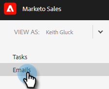

# Colonnes de courrier électronique et mise en page de la page de courrier électronique {#email-columns-and-email-page-layout}

Vous pouvez configurer n’importe quelle colonne disponible pour qu’elle soit visible dans la section Email du [Centre de commandes](/help/marketo/product-docs/marketo-sales-insight/actions/email/command-center/command-center-overview.md). Vos paramètres de configuration seront enregistrés pour chaque sous-dossier de courrier électronique (par exemple, Délivrés, En échec, Planifiés, etc.).

## Colonnes de courriel {#email-columns}

<table> 
 <colgroup> 
  <col> 
  <col> 
 </colgroup> 
 <tbody> 
  <tr> 
   <th>Colonne</th> 
   <th>Description</th> 
  </tr> 
  <tr> 
   <td><strong>Individu</td> 
   <td>Nom et adresse électronique de la personne dans Sales Connect. Cliquez sur ce champ pour ouvrir l’onglet À propos de dans la vue Détails de la personne.</td> 
  </tr> 
  <tr> 
   <td><strong>Nom</td> 
   <td>Nom de la personne dans Sales Connect.</td> 
  </tr> 
  <tr> 
   <td><strong>Adresse</td> 
   <td>Adresse électronique Principal de la personne dans Sales Connect.</td> 
  </tr> 
  <tr> 
   <td><strong>Campagne</td> 
   <td>Si l'email a été envoyé dans le cadre d'une campagne, le nom de la campagne s'affiche. Cliquez sur ce champ pour accéder à la page de configuration de cette campagne.</td> 
  </tr> 
  <tr> 
   <td><strong>Modèle</td> 
   <td>Affiche le nom du modèle (si l’email a été envoyé avec un).</td> 
  </tr> 
  <tr> 
   <td><strong>Objet</td> 
   <td>Objet de l’email.</td> 
  </tr> 
  <tr> 
   <td><strong>Groupes</td> 
   <td>Affiche les groupes auxquels le destinataire du courrier électronique appartient.</td> 
  </tr> 
  <tr> 
   <td><strong>Intitulé du poste</td> 
   <td>Titre du destinataire de l’email.</td> 
  </tr> 
  <tr> 
   <td><strong>Société</td> 
   <td>Société du destinataire de l’email.</td> 
  </tr> 
  <tr> 
   <td><strong>État de l’e-mail</td> 
   <td>État dans lequel se trouve le courrier électronique. Les états incluent : Version préliminaire, Planifiée, En Cours, Indésirable, Rebond, Échec, Envoyé. Les emails envoyés affichent un flux d’activité qui indique le nombre de consultations, de clics et de réponses qui ont eu lieu sur cet email.</td> 
  </tr> 
  <tr> 
   <td><strong>Date de création</td> 
   <td>Date de création de l’email.</td> 
  </tr> 
  <tr> 
   <td><strong>Dernière mise à jour</td> 
   <td>Date de la dernière mise à jour de l’email.</td> 
  </tr> 
  <tr> 
   <td><strong>Canal d’envoi</td> 
   <td>Nom du canal de diffusion utilisé pour l’envoi de l’email.</td> 
  </tr> 
  <tr> 
   <td><strong>Dernière activité</td> 
   <td>Dernier engagement du destinataire de l’email (par exemple, afficher, cliquer ou répondre).</td> 
  </tr> 
  <tr> 
   <td><strong>Date envoyée</td> 
   <td>Date d’envoi de l’email.</td> 
  </tr> 
  <tr> 
   <td><strong>Actions de suivi</td> 
   <td>Boutons d’action rapide pouvant être utilisés pour le suivi par email, téléphone, inMail ou tâche.</td> 
  </tr> 
  <tr> 
   <td><strong>E-mail groupé</td> 
   <td>Affiche une coche si le courrier électronique a été envoyé dans le cadre d’un message électronique de groupe.</td> 
  </tr> 
  <tr> 
   <td><strong>Échéance de la tâche</td> 
   <td>Affiche la date d’échéance des tâches liées au courrier électronique. Les tâches peuvent être liées à un email en étant créées à partir des boutons d’action rapide de la liste des emails.</td> 
  </tr> 
  <tr> 
   <td><strong>Action d’e-mail</td> 
   <td>Boutons d’action rapide pouvant être utilisés pour exécuter une action sur l’email. Selon l’état de l’email, les actions suivantes peuvent être disponibles : Archiver, Succès, Supprimer, Réessayer l’envoi, Désarchiver.</td> 
  </tr> 
  <tr> 
   <td><strong>Type de tâche</td> 
   <td>Affiche le type de tâche d’une tâche liée à l’email. Les tâches peuvent être liées à un email en étant créées à partir des boutons d’action rapide de la liste des emails.</td> 
  </tr> 
  <tr> 
   <td><strong>Échec de la date</td> 
   <td>Affiche la date d’échec du courrier électronique si celui-ci n’a pas été remis.</td> 
  </tr> 
 </tbody> 
</table>

## Paramètres de mise en page de page des emails {#email-page-layout-settings}

Vous pouvez configurer votre mise en page en procédant comme suit.

1. Dans l’application web, cliquez sur **Centre de commandes**.

   

1. Sélectionnez la section **Emails** .

   

1. Cliquez sur le bouton de configuration. Vos options sont les suivantes : choisir le nombre de lignes souhaité, sélectionner les champs à afficher et choisir si vous souhaitez que les emails de groupe soient regroupés en un seul élément de la grille (ou si vous souhaitez que tous les emails faisant partie d’une grille d’email s’affichent comme un seul élément).

   

1. Il vous suffit de cliquer en dehors de la zone de configuration lorsque vous avez terminé d’enregistrer les modifications.
