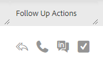

# Actions rapides dans le [!UICONTROL centre de commande] {#quick-actions-in-the-command-center}

La grille d’e-mail comporte deux types de colonnes d’action rapide. les actions E-mail, qui vous permettent d’agir sur l’e-mail, et les actions de suivi, qui vous permettent d’agir sur l’engagement en quelques clics.

## Actions rapides {#quick-actions}

Les actions rapides d’e-mail sont dynamiques et mises à jour en fonction des actions les plus pertinentes pour le statut de l’e-mail que vous regardez. Deux actions rapides au maximum sont visibles par statut d’e-mail. Vous pouvez voir ci-dessous les actions rapides relatives aux e-mails qui seront disponibles pour chaque statut.

**[!UICONTROL Délivrés]**

| Statut | Description |
|---|---|
| [!UICONTROL Archiver] | Ajoutera l’e-mail au dossier archivé et arrêtera toute la vue désactivée et le suivi des clics pour cet e-mail. |
| [!UICONTROL Succès] | Marquera l’e-mail comme réussi pour générer des rapports dans les analyses de modèles. |

**[!UICONTROL Archivé]**

<table>
 <colgroup>
  <col>
  <col>
 </colgroup>
 <tbody>
  <tr>
   <td>[!UICONTROL Unarchive]</td>
   <td>Renvoie l’e-mail dans le dossier diffusé et réactive le suivi des affichages/clics.</td>
  </tr>
  <tr>
   <td>[!UICONTROL Delete]</td>
   <td>
Supprimera l’e-mail. <strong>Remarque :</strong> les e-mails envoyés dans le cadre d’une campagne ne peuvent pas être supprimés.
</td>
  </tr>
 </tbody>
</table>

**[!UICONTROL Brouillon] et [!UICONTROL Planifié]**

<table>
 <colgroup>
  <col>
  <col>
 </colgroup>
 <tbody>
  <tr>
   <td>[!UICONTROL Edit]</td>
   <td>Ouvre l’e-mail dans la fenêtre de composition à modifier.</td>
  </tr>
  <tr>
   <td>[!UICONTROL Delete]</td>
   <td>
Supprimera l’e-mail. <strong>Remarque :</strong> les e-mails envoyés dans le cadre d’une campagne ne peuvent pas être supprimés.
</td>
  </tr>
 </tbody>
</table>

**[!UICONTROL Échec], [!UICONTROL Rebond] et [!UICONTROL Spam]**

<table>
 <colgroup>
  <col>
  <col>
 </colgroup>
 <tbody>
  <tr>
   <td>[!UICONTROL Retry Send]</td>
   <td>Tentera immédiatement de renvoyer l’e-mail.</td>
  </tr>
  <tr>
   <td>[!UICONTROL Delete]</td>
   <td>
Supprimera l’e-mail. <strong>Remarque :</strong> les e-mails envoyés dans le cadre d’une campagne ne peuvent pas être supprimés.
</td>
  </tr>
 </tbody>
</table>

**[!UICONTROL Actions de suivi]**

| Fonction | Description |
|---|---|
| Envoyer un e-mail de relance | Ouvre la fenêtre de composition avec le corps d’e-mail intégré sélectionné ajouté et prêt à être envoyé au destinataire. |
| Passer un appel | Ouvre le téléphone commercial pour passer un appel au destinataire de l&#39;e-mail. |
| Envoyer dans le courrier | Redirige vers [!DNL LinkedIn] pour envoyer un message InMail à la personne. |
| Créer une tâche | Ouvre la fenêtre contextuelle de création de tâche pour créer une tâche de rappel. |
