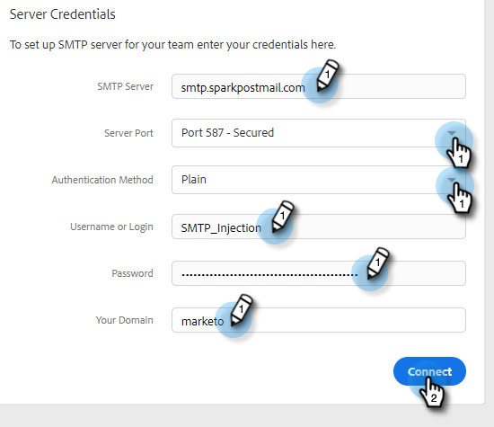

# Configurer un canal d’envoi personnalisé pour votre équipe {#set-up-a-custom-delivery-channel-for-your-team}

>[!NOTE]
>
>**Autorisations d’administration requises**

>[!NOTE]
>
>* Outre la configuration de votre serveur SMTP, votre identité [e-mail](/help/marketo/product-docs/marketo-sales-insight/actions/getting-started/email-settings/verify-your-email.md) doit être vérifiée avant que vous puissiez envoyer des e-mails.
>* Nous vous recommandons de travailler avec votre équipe informatique ou le fournisseur du serveur SMTP pour obtenir les informations d’identification du serveur SMTP appropriées.
>* Vous ne pouvez pas connecter vos serveurs Gmail et [!DNL Exchange] à l’aide des informations d’identification du serveur SMTP. Veuillez utiliser notre service de connexion par e-mail pour l&#39;intégration avec ces fournisseurs.

1. Cliquez sur l’icône d’engrenage et choisissez **[!UICONTROL Paramètres]**.

   

1. Sous [!UICONTROL Paramètres d’administration], cliquez sur **[!UICONTROL Général]**.

   

1. Cliquez sur l’onglet **[!UICONTROL Canal de diffusion de l’équipe]**.

   

1. Saisissez vos informations d&#39;identification de serveur SMTP et cliquez sur **[!UICONTROL Connect]**.

   

   >[!NOTE]
   >
   >Le serveur SMTP d&#39;équipe sera le canal de diffusion par défaut de l&#39;identité e-mail par défaut pour tous les membres de l&#39;équipe. En outre, elle sera disponible en tant qu’option de canal de diffusion pour toutes les autres identités d’e-mail.

   >[!MORELIKETHIS]
   >
   >* [Connexion par e-mail pour les utilisateurs Gmail](/help/marketo/product-docs/marketo-sales-connect/email-plugins/gmail/email-connection-for-gmail-users.md)
   >* [Connexion e-mail pour [!DNL Outlook] utilisateurs](/help/marketo/product-docs/marketo-sales-connect/email-plugins/msc-for-outlook/email-connection-for-outlook-users.md)
