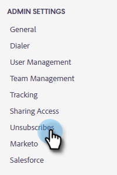

# Personnalisation du message de lien de désabonnement {#customize-unsubscribe-link-message}

Nous avons toujours autorisé les équipes à personnaliser leurs messages de lien de désabonnement, mais les administrateurs ont la possibilité de définir les messages de lien de désabonnement pour l’ensemble de leur équipe afin d’assurer une messagerie cohérente.

>[!NOTE]
>
>Vous ne pouvez pas utiliser de lien de désabonnement tiers avec les ventes Marketo, car ces informations ne seront pas récupérées dans notre base de données.

1. Cliquez sur l’icône d’engrenage et sélectionnez **Paramètres**.

   

1. Sous Paramètres d’administration, cliquez sur **Désabonne**.

   

1. Déterminez si ce message sera la valeur par défaut pour l’ensemble de l’équipe ou si vous souhaitez laisser l’équipe créer ses propres messages (dans cet exemple, nous choisissons la messagerie par défaut). Écrivez votre message personnalisé dans la zone de texte.

   

1. Sélectionnez le texte sur lequel vous souhaitez que les visiteurs cliquent pour accéder à votre page de désabonnement, puis cliquez sur l’icône de lien.

   

   >[!NOTE]
   >
   >Quelle que soit l’URL que vous saisissez. Lorsque l&#39;email est envoyé, le premier lien hypertexte (ou uniquement) est automatiquement associé à la page de désabonnement par défaut.

1. Saisissez une URL, déterminez si vous souhaitez que le lien s’ouvre dans la fenêtre active ou nouvelle, puis cliquez sur **Enregistrer**.

   

1. Cliquez sur **Enregistrer** dans la partie inférieure pour enregistrer vos modifications.

   
