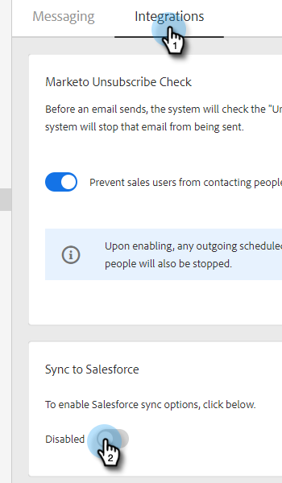
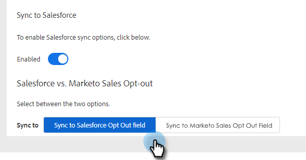
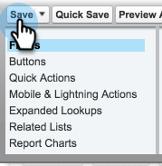

# Synchronisation des désabonnements avec [!DNL Salesforce] {#syncing-unsubscribes-with-salesforce}

Si vous souhaitez synchroniser les désabonnements avec un champ d’exclusion dans Salesforce, vous pouvez utiliser la synchronisation des désabonnements Salesforce.

## Conditions requises pour les désabonnements à la synchronisation avec Salesforce {#requirements-for-unsubscribes-to-sync-to-salesforce}

* La synchronisation du désabonnement doit être activée (pour la synchronisation de nuit).
* Le champ Opt-out doit être installé dans [!DNL Salesforce]
* Les enregistrements de personne dans [!DNL Marketo Sales] doivent avoir un ID [!DNL Salesforce]

**Désabonnements des notifications push**

Lorsqu’un désabonnement est collecté dans [!DNL Marketo Sales], nous le poussons à [!DNL Salesforce] en temps réel et mettons à jour l’un des champs d’exclusion que vous avez sélectionnés pour la synchronisation. Si vous avez désactivé la synchronisation [!DNL Salesforce], nous transmettrons toujours le désabonnement à l’option de désinscription à l’e-mail.

**Synchronisation du désabonnement**

Lorsque vous aurez activé la synchronisation de désabonnement (étape 3 ci-dessous), vous activerez la synchronisation de nuit. La synchronisation a lieu une fois par jour vers 20 :00 PST. Elle synchronise de manière bidirectionnelle tous les désabonnements dans les ventes Marketo avec le champ Désinscription dans Salesforce.

>[!NOTE]
>
>La synchronisation des désabonnements avec Salesforce synchronise les désabonnements, mais pas les réabonnements. Si vous souhaitez supprimer un désabonnement de Marketo Sales et Salesforce, décochez la case Se désabonner dans Salesforce et supprimez le désabonnement dans Marketo Sales.

## Configurer la synchronisation du désabonnement sur [!DNL Salesforce] {#configure-unsubscribe-sync-to-salesforce}

Les utilisateurs peuvent décider de synchroniser leurs désabonnements avec le champ d’opt-out d’e-mail standard que Marketo peut également synchroniser, ou avec le champ d’opt-out d’[!DNL Marketo Sales] afin de différencier les désabonnements aux ventes et les désabonnements au marketing.

1. Cliquez sur l’icône d’engrenage et sélectionnez **[!UICONTROL Paramètres]**.

   

1. Sous [!UICONTROL Paramètres d’administration] sélectionnez **[!UICONTROL Désabonnements]**.

   

1. Cliquez sur l’onglet **[!UICONTROL Intégrations]**. Sous [!UICONTROL Synchroniser avec Salesforce], activez la synchronisation nocturne.

   

1. Sélectionnez le champ vers lequel vous souhaitez effectuer la synchronisation.

   

   | Champ | Description |
   |---|---|
   | **Synchroniser avec [!DNL Salesforce] champ d’exclusion** | Sélectionné par défaut, ne met à jour que [!DNL Salesforce] champ Opt-out. |
   | **Synchroniser avec [!DNL Marketo Sales] champ d’exclusion** | Si vous souhaitez séparer les désabonnements aux ventes et au marketing, choisissez cette option pour mettre à jour un [[!DNL Marketo Sales] champ d’exclusion](#msoo) supplémentaire. |

## Installation du champ d’opt-out dans la mise en page {#installing-the-opt-out-field-in-the-page-layout}

**Désinscription Aux E-Mails**

L’Opt-out des e-mails est un champ standard dans [!DNL Salesforce] qui peut être installé à partir de [!DNL Salesforce]. Vous devez être un administrateur [!DNL Salesforce] pour l’installer.

1. Accédez à [Salesforce.com](https://salesforce.com) et connectez-vous.

   

1. Cliquez sur votre nom d’utilisateur et sélectionnez **[!UICONTROL Configuration]**.

   

1. Dans la zone de recherche rapide, recherchez le contact ou le prospect. Dans ce scénario, nous installons le champ sur la mise en page Page de contact, mais vous souhaiterez l’installer pour les deux enregistrements de personne.

   

1. Sélectionnez **[!UICONTROL Mises En Page]**.

   

1. Sélectionnez **[!UICONTROL Modifier]** en regard de la mise en page à laquelle vous souhaitez ajouter le champ.

   

1. Sélectionnez **[!UICONTROL Champs]**.

   

1. Effectuez un glisser-déposer [!UICONTROL Désinscription par e-mail] dans la disposition de la page.

   

1. Cliquez sur **[!UICONTROL Enregistrer]**.

   

## Désabonnement Marketo Sales {#marketo-sales-opt-out}

Le champ Droit d’opposition (opt-out) aux ventes Marketo est un champ personnalisé disponible pour les utilisateurs qui ont installé le package Marketo Sales Insight [à partir d’AppExchange](/help/marketo/product-docs/marketo-sales-insight/msi-for-salesforce/installation/install-marketo-sales-insight-package-in-salesforce-appexchange.md){target="_blank"}.

Une fois que vous avez installé le package Marketo Sales Insight d’AppExchange dans Salesforce, le champ d’exclusion des ventes de Marketo s’affiche.
