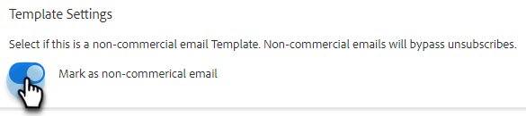
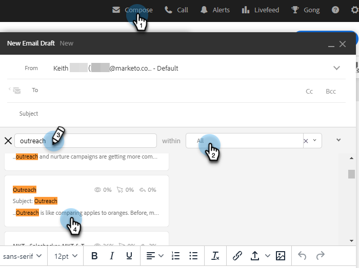

# Modèles d’e-mail de vente transactionnelle {#transactional-sales-email-templates}

Si votre équipe envoie des e-mails transactionnels ou non commerciaux, vous pouvez marquer un modèle d’e-mail comme non commercial afin qu’il puisse contourner les désabonnements.

## Éléments à noter {#things-to-note}

* Les e-mails non commerciaux contourneront les désabonnements des ventes et la vérification du désabonnement de [Marketo Engage](/help/marketo/product-docs/marketo-sales-insight/actions/email/unsubscribes/marketo-unsubscribe-check.md){target="_blank"} mais ne contourneront pas les domaines [&#x200B; bloqués](/help/marketo/product-docs/marketo-sales-insight/actions/admin/blocked-domains.md){target="_blank"}.

* Les messages de désabonnement ne seront pas automatiquement ajoutés aux e-mails non commerciaux, même si le paramètre [Ajouter un administrateur de messages de désabonnement](/help/marketo/product-docs/marketo-sales-insight/actions/email/unsubscribes/auto-append-unsubscribe-message-setting.md){target="_blank"} est activé. Cependant, le `{{team_unsubscribe}}` [champ dynamique](/help/marketo/product-docs/marketo-sales-insight/actions/templates/dynamic-fields.md){target="_blank"} remplira toujours le message de désabonnement de votre équipe.

## Configurer un modèle d’e-mail pour une utilisation non commerciale {#configure-an-email-template-for-non-commercial-use}

1. Dans l’en-tête, cliquez sur **Modèles**.

   

1. Recherchez et sélectionnez le modèle à mettre à jour.

   

1. Activez le bouton (bascule) E-mail non commercial sous Paramètres du modèle.

   

## Envoyer un e-mail non commercial {#send-a-non-commercial-email}

>[!NOTE]
>
>Lorsqu’une personne désabonnée est sélectionnée, elle est mise en surbrillance orange.

1. Dans l’en-tête, cliquez sur **Composer**. Recherchez et sélectionnez le modèle non commercial souhaité.

   

1. Une bannière s’affiche pour indiquer que les utilisateurs et utilisatrices ont sélectionné un modèle d’e-mail non commercial.

   

1. Cliquez sur **Envoyer**.

   

L’e-mail sera toujours envoyé même si la personne est désabonnée.
