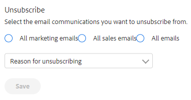
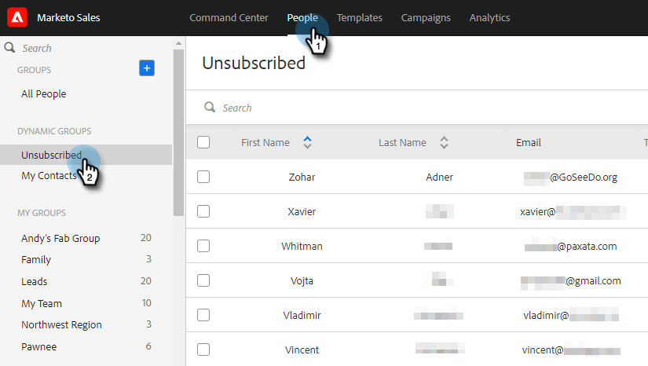

# Présentation du désabonnement {#unsubscribe-overview}

Il devient de plus en plus important pour les organisations de se conformer aux lois sur la confidentialité des emails. Pour vous aider, nous avons apporté quelques améliorations à notre expérience de désabonnement.

* Les liens de désabonnement sont placés sur tous les emails envoyés par Marketo Sales et Salesforce (cela ne s’applique pas aux emails personnalisés envoyés depuis Outlook ou Gmail).
* Les administrateurs peuvent modifier les messages de désabonnement pour l’ensemble de l’équipe.
* Les informations de désabonnement sont stockées dans PDV
* Les désabonnements peuvent être effectués manuellement : lien cliqué, synchronisation Salesforce et rebond
* Nouvelle page d’entrée de lien de désabonnement

## Désabonner la page d’entrée des liens {#unsubscribe-link-landing-page}

Lorsqu’une personne clique sur votre lien de désabonnement, elle est redirigée vers une landing page de désabonnement dans laquelle elle peut sélectionner ce à quoi elle souhaite se désabonner et pourquoi.

Ces informations seront enregistrées dans la vue des détails de la personne pour une consultation ultérieure.

## Unsubscribe Group {#unsubscribe-group}

Visualisez et gérez toutes vos personnes désabonnées au même endroit.

Utilisez la barre de recherche pour rechercher les personnes désabonnées.

Si vous êtes administrateur, vous pouvez accéder au groupe de désabonnement pour filtrer par Désabonnements au compte et voir tous les désabonnements collectés dans la base de données des personnes.

## Désabonner la carte d’historique {#unsubscribe-history-card}

La carte d’historique de désabonnement permet aux administrateurs et aux utilisateurs d’obtenir des informations contextuelles sur l’historique de désabonnement de leurs contacts. Accédez à l’onglet Personnes et sélectionnez une personne. Elle se trouve au bas de l’onglet À propos de dans la vue Détails de la personne.

>[!NOTE]
>
>Il n’y aura une carte d’historique de désabonnement que si la personne a _réabonné_ à un moment donné.

<table> 
 <colgroup> 
  <col> 
  <col> 
 </colgroup> 
 <tbody> 
  <tr> 
   <td><strong>Date</strong></td> 
   <td>
Affiche la date à laquelle le désabonnement/réabonnement a eu lieu.
</td> 
  </tr> 
  <tr> 
   <td><strong>Détails</strong></td> 
   <td>
Resabonner : un administrateur de Sales Connect a manuellement supprimé le désabonnement de l’enregistrement de contact. Il peut également indiquer des détails relatifs à la raison de la désinscription du contact.

Désabonner : le contact a été désabonné.
</td> 
  </tr> 
  <tr> 
   <td><strong>Source</strong></td> 
   <td>
Synchronisation Salesforce : le désabonnement a été capturé par une synchronisation avec Salesforce.

Manuel : l’utilisateur a cliqué sur le bouton de désabonnement pour se désabonner.

Lien cliqué : le destinataire d’un email a cliqué sur le lien de désabonnement.

"Nom de l’administrateur" : le nom de l’administrateur s’affiche lorsque l’action a été effectuée pour réabonner les contacts. Cela permet aux utilisateurs de savoir qui a supprimé le désabonnement.
</td> 
  </tr> 
 </tbody> 
</table>

>[!MORELIKETHIS]
>
>[Personnaliser le message de lien de désabonnement](/help/marketo/product-docs/marketo-sales-insight/actions/email/unsubscribes/customize-unsubscribe-link-message.md)
