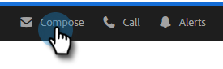
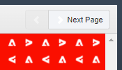

# Ajout d’une pièce jointe ou d’un contenu pouvant faire l’objet d’un suivi à votre message électronique {#add-an-attachment-or-trackable-content-to-your-email}

Lors de l’envoi d’un email par le biais de Marketo Sales, vous avez la possibilité d’ajouter un fichier en tant que pièce jointe ou de faire d’un fichier un lien téléchargeable (et pouvant faire l’objet d’un suivi).

>[!NOTE]
>
>En règle générale, tout fichier de plus de 20 Mo est trop volumineux pour être livré. La taille d’une pièce jointe que vous pouvez envoyer par email varie en fonction du canal de diffusion que vous utilisez.

## Ajout d’une pièce jointe {#add-an-attachment}

1. Créez votre brouillon d&#39;email (il existe plusieurs façons de le faire, dans cet exemple, nous choisissons **Composer** dans l&#39;en-tête).

   

1. Renseignez le champ À et saisissez un Objet.

   

1. Cliquez sur l’icône de pièce jointe.

   

1. Sélectionnez le fichier à joindre et cliquez sur **Insérer**.

   

   >[!NOTE]
   >
   >Si vous devez télécharger un fichier, cliquez sur le bouton **Télécharger le contenu** dans le coin supérieur droit de la fenêtre.

   La pièce jointe apparaît au bas de votre email.

   

## Ajout de contenu pouvant faire l’objet d’un suivi {#add-trackable-content}

1. Créez votre brouillon d&#39;email (il existe plusieurs façons de le faire, dans cet exemple, nous choisissons la fenêtre Composer ).

   

1. Renseignez le champ À et saisissez un Objet.

   

1. Cliquez sur l&#39;emplacement dans l&#39;email où vous souhaitez que le contenu pouvant faire l&#39;objet d&#39;un suivi s&#39;affiche, puis cliquez sur l&#39;icône de pièce jointe.

   

1. Sélectionnez le contenu à ajouter, cliquez sur le curseur **Contenu suivi**, puis cliquez sur **Insérer**.

   

   >[!NOTE]
   >
   >Si vous devez télécharger un fichier, cliquez sur le bouton **Télécharger le contenu** dans le coin supérieur droit de la fenêtre.

   Le contenu s’affiche sous la forme d’un lien dans votre email. Le destinataire peut cliquer sur le lien pour télécharger le contenu.

   

   >[!NOTE]
   >
   >Les utilisateurs seront avertis dans le flux en direct lorsque les utilisateurs afficheront leur contenu suivi. Les utilisateurs peuvent également voir le contenu le plus performant dans la section de contenu de la page Analytics.

## Mises à jour de contenu pouvant faire l’objet d’un suivi {#trackable-content-updates}

**Visionneuse de contenu pouvant faire l’objet d’un suivi**

Lorsqu’un prospect clique sur du contenu pouvant faire l’objet d’un suivi dans votre email, il ouvre une visionneuse de contenu.

Dans les pistes de la visionneuse de contenu, procédez comme suit.

* Télécharger le document

* Page à travers le document

* Afficher les coordonnées de l’expéditeur

**Événements de contenu pouvant faire l’objet d’un suivi dans le flux en direct**

Lorsqu’un prospect clique sur le lien de votre document, un événement de clic s’affiche. Vous pouvez cliquer sur ce lien pour visualiser le contenu. Tant que vous êtes connecté à votre compte Actions dans le navigateur, nous ne comptabiliserons pas ces clics comme des événements.

Chaque fois que la piste passe à une autre page du document, vous recevez un événement Visionné dans le flux en direct qui indique le nom du document.
