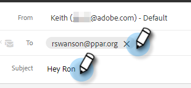

# Ajouter une pièce jointe ou du contenu pouvant être suivi à votre e-mail {#add-an-attachment-or-trackable-content-to-your-email}

Lors de l’envoi d’un e-mail par l’intermédiaire de [!DNL Marketo Sales], vous avez la possibilité d’ajouter un fichier en pièce jointe ou de faire d’un fichier un lien téléchargeable (et traçable).

>[!NOTE]
>
>En règle générale, tout fichier de plus de 20 Mo est trop volumineux pour être diffusé. La taille d’une pièce jointe que vous pouvez envoyer par e-mail varie en fonction du canal de diffusion que vous utilisez.

## Ajouter une pièce jointe {#add-an-attachment}

1. Créez votre brouillon d’e-mail (il existe plusieurs façons de le faire, dans cet exemple nous choisissons **[!UICONTROL Composer]** dans l’en-tête).

   

1. Renseignez le champ [!UICONTROL À] et saisissez un [!UICONTROL Objet].

   

1. Cliquez sur l’icône de pièce jointe.

   

1. Sélectionnez le fichier à joindre et cliquez sur **[!UICONTROL Insérer]**.

   

   >[!NOTE]
   >
   >Si vous devez charger un fichier, cliquez sur le bouton **[!UICONTROL Charger le contenu]** dans le coin supérieur droit de la fenêtre.

   La pièce jointe s’affiche au bas de votre e-mail.

   

## Ajouter du contenu pouvant être suivi {#add-trackable-content}

1. Créez votre brouillon d’e-mail (il existe plusieurs façons de le faire, dans cet exemple nous choisissons la fenêtre **[!UICONTROL Composer]**).

   

1. Renseignez le champ [!UICONTROL À] et saisissez un [!UICONTROL Objet].

   

1. Cliquez à l’endroit de l’e-mail où vous souhaitez que le contenu trackable apparaisse, puis cliquez sur l’icône de la pièce jointe.

   

1. Sélectionnez le contenu à ajouter, cliquez sur le curseur **[!UICONTROL Le contenu est suivi]**, puis sur **[!UICONTROL Insérer]**.

   

   >[!NOTE]
   >
   >Si vous devez charger un fichier, cliquez sur le bouton **[!UICONTROL Charger le contenu]** dans le coin supérieur droit de la fenêtre.

   Le contenu s’affiche sous forme de lien dans l’e-mail. Le destinataire peut cliquer sur le lien pour télécharger le contenu.

   

   >[!NOTE]
   >
   >Les utilisateurs seront avertis dans le flux en direct lorsque les personnes consulteront leur contenu suivi. Les utilisateurs peuvent également voir le contenu le plus performant dans la section de contenu de la page Analytics.

## Mises à jour de contenu pouvant faire l’objet d’un suivi {#trackable-content-updates}

**Visionneuse de contenu pouvant être suivie**

Lorsqu’un prospect clique sur du contenu pouvant être suivi dans votre e-mail, une visionneuse de contenu s’ouvre.

Dans la visionneuse de contenu, les prospects peuvent effectuer les opérations suivantes.

* Télécharger le document

* Parcourir le document

* Afficher les coordonnées de l&#39;expéditeur

**Événements de contenu pouvant être suivis dans le flux en direct**

Lorsqu’un prospect clique sur le lien de notre document, un événement de clic s’affiche. Vous pouvez cliquer sur ce lien pour afficher le contenu. Tant que vous êtes connecté à votre compte Actions dans le navigateur, nous ne comptabiliserons pas ces clics comme des événements.

Chaque fois que le prospect accède à une autre page du document, vous recevez un événement Consulté dans le flux en direct qui indique le nom du document.
