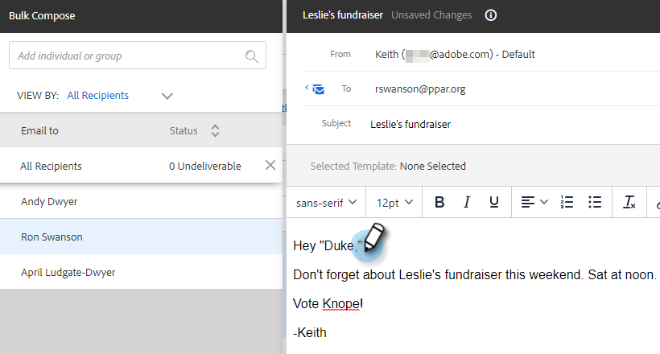

# Composition d’e-mails en masse avec les options Sélectionner et Envoyer {#composing-bulk-emails-with-select-and-send}

Voici comment envoyer/modifier des e-mails à l’aide des options [!UICONTROL Sélectionner] et [!UICONTROL Envoyer].

## Envoi des e-mails {#sending-emails}

1. Accédez à la **[!UICONTROL page Personnes]**.

   

1. Sélectionnez les personnes à envoyer par e-mail.

   

   >[!NOTE]
   >
   >200 personnes au maximum peuvent être sélectionnées lors de l’utilisation des options Sélectionner et Envoyer.

1. Cliquez sur le bouton **[!UICONTROL E-mail sélectionné]**.

   

1. Saisissez un objet, sélectionnez un modèle (ou composez l’e-mail à partir de zéro) et envoyez/[planifiez](/help/marketo/product-docs/marketo-sales-connect/email/using-the-compose-window/scheduling-an-email.md) l’e-mail.

   

   >[!NOTE]
   >
   >Si vous avez sélectionné un modèle et souhaitez vérifier que tous les champs dynamiques sont correctement renseignés avant l’envoi, cliquez sur **[!UICONTROL Prévisualiser les champs dynamiques]**. Assurez-vous que tous les destinataires de la barre latérale en bloc sont sélectionnés pour la prévisualisation de tous les e-mails. Si vous sélectionnez un e-mail et cliquez sur **[!UICONTROL Prévisualiser les champs dynamiques]**, seul cet e-mail sera prévisualisé.

## Modification des e-mails {#editing-emails}

**Modifications en bloc**

1. Suivez les étapes 1 à 3 de la section [Envoi d’e-mails](#sending-emails) ci-dessus.

   >[!NOTE]
   >
   >Tous les destinataires seront sélectionnés par défaut. Si vous cliquez sur une personne et souhaitez sélectionner à nouveau tout le monde, cliquez sur **[!UICONTROL Tous les destinataires]**. Pour rappel, tous les destinataires doivent être sélectionnés pour effectuer des modifications en bloc.

1. Apportez vos modifications dans l’éditeur. Vous pouvez créer un e-mail ou modifier un modèle (dans cet exemple, nous créons un e-mail).

   

   >[!NOTE]
   >
   >Vous pouvez cliquer sur un destinataire d’e-mail spécifique pour voir les modifications propagées à cet e-mail.

1. Cliquez sur **[!UICONTROL Envoyer]** (ou [[!UICONTROL Planifier]](/help/marketo/product-docs/marketo-sales-connect/email/using-the-compose-window/scheduling-an-email.md)) pour envoyer à tous les destinataires les mises à jour par e-mail en bloc que vous avez effectuées.

   

**Modifier Chaque E-Mail**

Effectuez les mises à jour en bloc avant de personnaliser chaque e-mail, car la réalisation d’une mise à jour en bloc remplace les modifications apportées à chaque e-mail de la barre latérale de composition en bloc.

1. Suivez les étapes 1 à 4 de la section [Envoi d’e-mails](#sending-emails).

   >[!NOTE]
   >
   >Tous les destinataires seront sélectionnés par défaut. Si vous cliquez sur une personne et souhaitez sélectionner à nouveau tout le monde, cliquez sur **[!UICONTROL Tous les destinataires]**. Pour rappel, tous les destinataires doivent être sélectionnés pour effectuer des modifications en bloc.

1. Sélectionnez un destinataire individuel.

   

1. Apportez vos modifications dans l’éditeur.

   

   >[!NOTE]
   >
   >C’est là que vous pouvez apporter des modifications à un seul e-mail dans la barre latérale en bloc sans mettre à jour le reste des e-mails.

   >[!TIP]
   >
   >Vous pouvez cliquer sur d’autres destinataires pour constater que les modifications que vous avez apportées au destinataire précédemment sélectionné ne s’affichent pas.

1. Cliquez sur **[!UICONTROL Envoyer]** (ou [[!UICONTROL Planifier]](/help/marketo/product-docs/marketo-sales-connect/email/using-the-compose-window/scheduling-an-email.md)) pour envoyer à tous les destinataires les mises à jour par e-mail en bloc que vous avez effectuées.

   

   >[!MORELIKETHIS]
   >
   >* [Options de publipostage en bloc](/help/marketo/product-docs/marketo-sales-insight/actions/email/using-the-compose-window/bulk-emailing-options.md)
   >* [Utilisation d’un modèle dans la fenêtre Composer](/help/marketo/product-docs/marketo-sales-connect/email/using-the-compose-window/using-a-template-in-the-compose-window.md)
   >* [Champs dynamiques](/help/marketo/product-docs/marketo-sales-connect/templates/dynamic-fields/how-to-insert-dynamic-fields.md)
