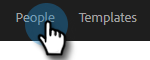
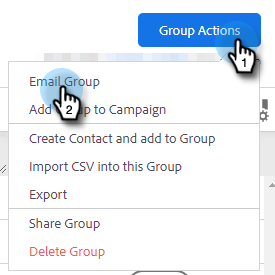

# Envoi d’e-mails via la fonction E-mail de groupe {#sending-emails-via-group-email}

Voici comment envoyer/modifier des e-mails à l’aide de l’option Regrouper les e-mails .

## Envoi d’un e-mail de groupe {#sending-a-group-email}

1. Cliquez sur l’onglet **[!UICONTROL Personnes]**.

   

1. Sélectionnez le groupe que vous souhaitez envoyer par e-mail.

   

1. Cliquez sur le bouton [!UICONTROL Actions de groupe] et sélectionnez **[!UICONTROL Groupe d’e-mails]**.

   

1. Remplissez votre e-mail (ou sélectionnez un modèle) et envoyez-le (ou planifiez-le).

   

## Modification d’un e-mail de groupe {#editing-a-group-email}

1. Créez un e-mail de groupe à l’aide des [étapes 1 à 3 ci-dessus](#sending-a-group-email).

1. [Choisissez un modèle](/help/marketo/product-docs/marketo-sales-insight/actions/email/using-the-compose-window/using-a-template-in-the-compose-window.md) ou renseignez votre e-mail.

   

1. Une fois l’e-mail envoyé, vous pouvez prévisualiser chaque e-mail de la liste pour voir si les champs dynamiques sont correctement renseignés.

   

1. Sélectionnez le destinataire visé et cliquez sur **[!UICONTROL Aperçu des champs dynamiques]**. Affichez l’aperçu à droite.

   

   >[!NOTE]
   >
   >Vous pouvez apporter des modifications en bloc à l’e-mail/au modèle lors de l’envoi d’e-mails de groupe, mais vous ne pouvez pas apporter de modifications uniques à des destinataires spécifiques dans la liste.

>[!MORELIKETHIS]
>
>* [Options d’envoi en bloc](/help/marketo/product-docs/marketo-sales-insight/actions/email/using-the-compose-window/bulk-emailing-options.md)
>* [Utilisation d’un modèle dans la fenêtre Composer](/help/marketo/product-docs/marketo-sales-insight/actions/email/using-the-compose-window/using-a-template-in-the-compose-window.md)
