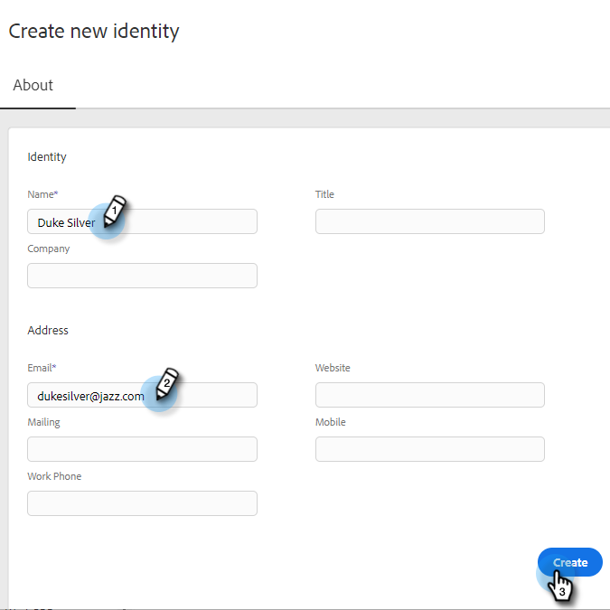

# Ajouter une identité {#add-identity}

Ajoutez une identité lorsque vous disposez de plusieurs adresses e-mail à partir desquelles envoyer.

>[!NOTE]
>
>L’utilisation de plusieurs identités n’est pas prise en charge avec les canaux de diffusion Gmail ou Outlook/Exchange. Gmail et Outlook/Exchange s’authentifient au niveau de l’utilisateur, de sorte que seuls les e-mails provenant de l’adresse e-mail connectée seront envoyés. Pour utiliser plusieurs identités avec des adresses e-mail différentes, vous devez connecter un fournisseur SMTP tiers (canal de diffusion e-mail) qui vous permet d&#39;enregistrer les domaines de messagerie à partir desquels effectuer l&#39;envoi. Cela permet aux utilisateurs de se connecter au canal de diffusion SMTP et d’envoyer des messages à partir de n’importe quelle adresse e-mail tant qu’ils sont un domaine enregistré.

1. Cliquez sur l’icône Paramètres .

   

1. Cliquez sur **[!UICONTROL Paramètres de messagerie]**.

   

1. Cliquez sur **[!UICONTROL Ajouter une identité]**.

   

1. Saisissez les informations (les champs e-mail et nom sont obligatoires) et cliquez sur **[!UICONTROL Créer]**.

   

1. Vous recevrez alors un e-mail de type « Veuillez vérifier votre adresse e-mail ». Pour vérifier, cliquez sur **[!UICONTROL Vérifier l’adresse électronique]**.

   

Lorsque vous envoyez un e-mail dans Ventes Marketo et que vous disposez de plusieurs identités, vous pouvez basculer entre elles.

>[!NOTE]
>
>Le nombre d’identités d’e-mail que vous pouvez configurer n’est pas limité.

>[!MORELIKETHIS]
>
>[Ajoutez ou mettez à jour votre signature d’e-mail](/help/marketo/product-docs/marketo-sales-insight/actions/getting-started/email-settings/add-or-update-your-email-signature.md).
