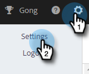
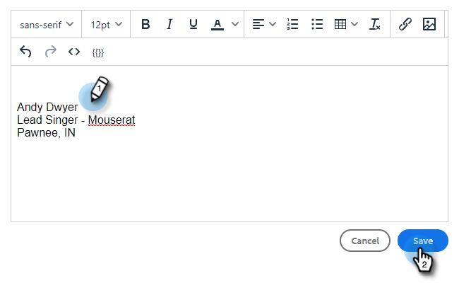

# Ajouter ou mettre à jour votre signature d’e-mail {#add-or-update-your-email-signature}

Nous voulons que les e-mails des ventes Marketo se sentent comme une expérience transparente lors de l’envoi à partir de votre propre client de messagerie. Pour ce faire, ajoutez votre signature d’e-mail.

1. Cliquez sur l’icône d’engrenage et sélectionnez **[!UICONTROL Paramètres]**.

   

1. Sous [!UICONTROL Mon compte], sélectionnez **[!UICONTROL Paramètres de messagerie]**.

   

1. Dans l’onglet **[!UICONTROL Adresse et signature]**, sélectionnez l’identité de l’e-mail pour laquelle vous souhaitez créer une signature.

   

1. Dans la carte [!UICONTROL Signature], cliquez sur **[!UICONTROL Modifier]**.

   

1. Saisissez le texte (ou les images) souhaité(s) et cliquez sur **[!UICONTROL Enregistrer]**.

   

   >[!TIP]
   >
   >Assurez-vous que la signature qui apparaît sur l’écran de composition est identique à celle qui figure dans votre client de messagerie.
