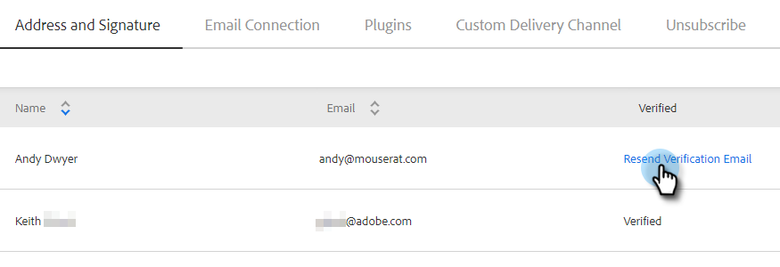

# Vérifier votre e-mail {#verify-your-email}

Si votre identité n’est pas vérifiée, procédez comme suit.

1. Cliquez sur l’icône d’engrenage en haut à droite et choisissez **[!UICONTROL Paramètres]**.

   

1. Sous [!UICONTROL Mon compte], cliquez sur **[!UICONTROL Paramètres de messagerie]**.

   

1. Sous [!UICONTROL Adresse et signature], recherchez l’e-mail à vérifier et cliquez sur **[!UICONTROL Renvoyer l’e-mail de vérification]**. Un nouvel e-mail de vérification sera envoyé.

   

1. Cliquez sur **[!UICONTROL Renvoyer]**.

   

1. Le destinataire ouvre ensuite l’e-mail et suit les étapes de vérification de l’adresse e-mail.

   

>[!NOTE]
>
>Si vous ne recevez pas l’e-mail de vérification, vérifiez votre dossier de courriers indésirables. S&#39;il n&#39;est pas là, contactez l&#39;assistance de .
