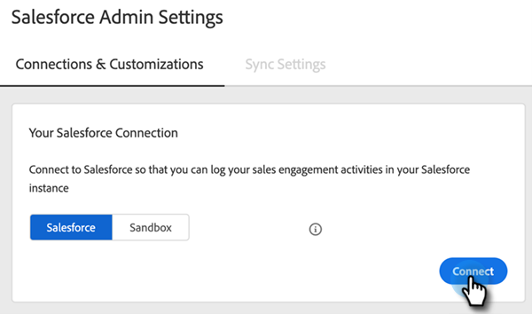
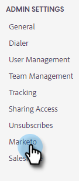

# Guide de configuration de l’administration pour Actions des informations sur les ventes {#sales-insight-actions-admin-setup-guide}

>[!NOTE]
>
>Marketo Sales Insight Actions est une application web qui s’intègre exclusivement au CRM Salesforce via le package [Marketo Sales Insight](/help/marketo/product-docs/marketo-sales-insight/msi-for-salesforce/installation/install-marketo-sales-insight-package-in-salesforce-appexchange.md){target="_blank"}. Il est parfois appelé « Ventes Marketo » ou simplement « Actions ».

>[!PREREQUISITES]
>
>* Vérifiez auprès de l’équipe du compte Adobe (votre gestionnaire de compte) que les actions MSI ont été activées pour votre compte Marketo Engage (si vous ne disposez pas d’un gestionnaire de compte, contactez [l’assistance Marketo](https://nation.marketo.com/t5/support/ct-p/Support){target="_blank"}).
>* La synchronisation Marketo/Salesforce doit être configurée.

<table>
 <tr>
  <th>Persona</th>
  <th>Étape</th>
 </tr>
 <tr>
  <td>Administrateur Marketo</td>
  <td>Configurer un compte commercial Marketo</td>
 </tr>
 <tr>
  <td>Administrateur Marketo ou administrateur  [!DNL Salesforce]</td>
  <td>Connecter le compte commercial Marketo à [!DNL Salesforce]</td>
 </tr>
 <tr>
  <td>Administrateur Marketo</td>
  <td>Connecter le compte commercial Marketo à Marketo</td>
 </tr>
 <tr>
  <td>Administrateur Marketo</td>
  <td>Lancer la synchronisation des données de Marketo vers le compte client Marketo</td>
 </tr>
 <tr>
  <td>Administrateur Marketo</td>
  <td>Inviter des utilisateurs à MSI-Actions</td>
 </tr>
 <tr>
  <td>[!DNL Salesforce] Administration</td>
  <td>Installer/Mettre à niveau le package MSI dans [!DNL Salesforce]</td>
 </tr>
 <tr>
  <td>[!DNL Salesforce] Administration</td>
  <td>Configuration de MSI-Actions dans [!DNL Salesforce]</td>
 </tr>
</table>

## Configurer un compte client Marketo {#set-up-marketo-sales-account}

1. Dans Marketo, cliquez sur **[!UICONTROL Admin]**.

   

   >[!NOTE]
   >
   >Si vous ne voyez pas d’ID client et de secret client sur la carte Informations sur l’intégration , activez votre instance Actions en invitant le premier utilisateur. L’ID client et le secret client s’affichent alors.

1. Cliquez sur **Ventes Insight**, puis sur **Configuration des actions**. Dans une liste d’administrateurs Marketo à inviter, sélectionnez-en un, puis cliquez sur **Envoyer l’invitation**.

   

L’utilisateur recevra un e-mail contenant les étapes à suivre pour accéder au compte.

>[!NOTE]
>
>Les utilisateurs supplémentaires ne seront pas ajoutés via Marketo, mais via la page Gestion des utilisateurs de compte de vente. [Cliquez ici](/help/marketo/product-docs/marketo-sales-connect/admin/invite-users.md){target="_blank"} pour en savoir plus sur l’ajout d’utilisateurs supplémentaires.

## Connecter le compte commercial Marketo à [!DNL Salesforce] {#connect-marketo-sales-account-to-salesforce}

1. Dans votre compte commercial Marketo, cliquez sur l’icône d’engrenage et sélectionnez **[!UICONTROL Paramètres]**.

   

1. Sous [!UICONTROL Paramètres d’administration], cliquez sur **[!UICONTROL Salesforce]**.

   

1. Dans l’onglet [!UICONTROL Connexions et personnalisations], cliquez sur **[!UICONTROL Se connecter]**.

   

1. Cliquez sur **[!UICONTROL OK]**.

   

Si vous êtes déjà connecté à Salesforce, vous serez connecté. Si ce n&#39;est pas le cas, on vous demandera de vous connecter.

## Connexion de Marketo à votre compte d’applications commerciales {#connect-marketo-to-your-sales-apps-account}

1. Dans votre compte commercial Marketo, cliquez sur l’icône d’engrenage et sélectionnez **[!UICONTROL Paramètres]**.

   

1. Sous [!UICONTROL Paramètres d’administration], cliquez sur **Marketo**.

   

1. Cliquez sur **[!UICONTROL se connecter]**. Votre compte sera alors connecté.

   

>[!NOTE]
>
>S’il ne se connecte pas, copiez les informations d’identification de l’onglet « Configuration des actions » de Marketo Sales Insight et collez-les dans l’onglet Configuration .

## Lancer la synchronisation des données {#initiate-data-sync}

La synchronisation des champs d’unification des données pour les actions de Sales Insight permet au système d’extraire des informations sur la personne de votre base de données Marketo Engage vers votre base de données d’actions de Sales Insight, en maintenant vos données de personnel à jour et en s’assurant que les activités sont consignées dans les bons enregistrements dans Marketo et [!DNL Salesforce].

>[!CAUTION]
>
>Une fois que vous avez lancé la synchronisation des données, vous ne devez **pas** supprimer l’utilisateur d’origine sur votre instance Sales Insight Actions. Il s’agit de l’utilisateur auquel la première invitation a été envoyée.

1. Dans Marketo, cliquez sur **[!UICONTROL Admin]**.

   

1. Cliquez sur **[!UICONTROL Ventes Insight]**.

   

1. Cliquez sur l’onglet **[!UICONTROL Configuration des actions]**. Dans la carte Synchronisation du champ d’action , cliquez sur **[!UICONTROL Synchronisation]**.

   

1. Un aperçu des champs qui seront synchronisés s’affiche. Cliquez sur **[!UICONTROL Démarrer la synchronisation]**.

   

Les enregistrements de personne qui existent dans Marketo et [!DNL Salesforce] seront synchronisés avec votre compte Marketo Sales Apps.

>[!NOTE]
>
>Pour en savoir plus sur la manière dont les données de personnes et d’activités se synchronisent entre les actions de Sales Insight, Marketo et Salesforce, [cliquez ici](/help/marketo/product-docs/marketo-sales-insight/actions/admin/sync-sales-action-data-with-marketo-and-salesforce.md){target="_blank"}.

## Inviter des utilisateurs individuels à participer à des actions MSI {#invite-individual-users-to-msi-actions}

1. Dans votre compte commercial Marketo, cliquez sur l’icône d’engrenage et sélectionnez **[!UICONTROL Paramètres]**.

   

1. Sous [!UICONTROL Paramètres d’administration], sélectionnez **[!UICONTROL Gestion des utilisateurs]**.

   

1. Cliquez sur **[!UICONTROL Actions]** et sélectionnez **[!UICONTROL Inviter des utilisateurs]**.

   

1. Saisissez la ou les adresses e-mail et cliquez sur **[!UICONTROL Inviter]**.

   

>[!NOTE]
>
>Par défaut, tous les nouveaux membres sont ajoutés à l’équipe Tout le monde.

Vous recevrez un message de confirmation.

## Inviter des utilisateurs via CSV à des actions MSI {#invite-users-via-csv-to-msi-actions}

1. Dans votre compte commercial Marketo, cliquez sur l’icône d’engrenage et sélectionnez **[!UICONTROL Paramètres]**.

   

1. Sous [!UICONTROL Paramètres d’administration], sélectionnez **[!UICONTROL Gestion des utilisateurs]**.

   

1. Cliquez sur **[!UICONTROL Actions]** et sélectionnez **[!UICONTROL Inviter des utilisateurs via CSV]**.

   

1. Recherchez le fichier CSV sur votre ordinateur, sélectionnez-le, puis cliquez sur **[!UICONTROL Suivant]**.

   

1. Vérifiez que les champs sont correctement mappés et cliquez sur **[!UICONTROL Inviter]**.

   

Vous recevrez un message de confirmation une fois les invitations envoyées.

>[!NOTE]
>
>Une fois cette opération effectuée, vous pouvez mettre à niveau votre package MSI existant ou en installer un nouveau et passer à la [configuration des actions MSI dans Salesforce](/help/marketo/product-docs/marketo-sales-insight/actions/crm/salesforce-package-configuration/sales-insight-actions-configuration-in-salesforce.md){target="_blank"}.
