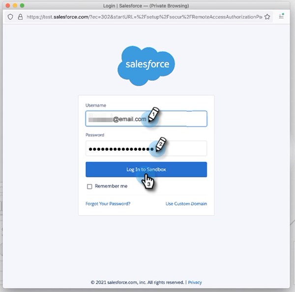
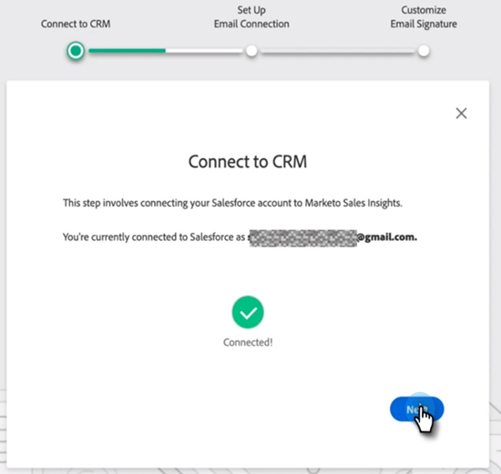
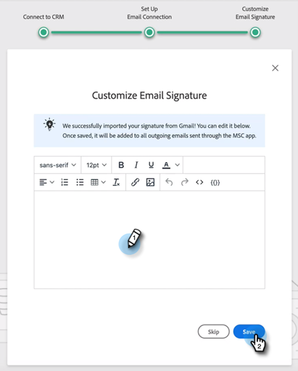
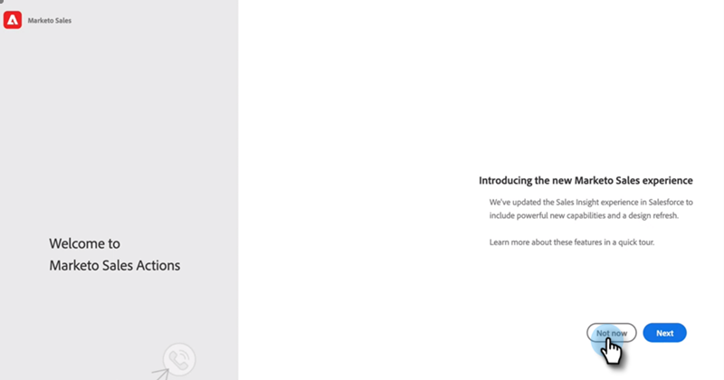

# Guide d’intégration des utilisateurs des actions Insight Sales {#sales-insight-actions-user-onboarding-guide}

>[!NOTE]
>
>Marketo Sales Insight Actions est une application web qui s’intègre exclusivement au CRM Salesforce via le package [Marketo Sales Insight](/help/marketo/product-docs/marketo-sales-insight/msi-for-salesforce/installation/install-marketo-sales-insight-package-in-salesforce-appexchange.md){target="_blank"}. Il est parfois appelé « Ventes Marketo » ou simplement « Actions ».

>[!PREREQUISITES]
>
>* Un administrateur doit inviter un utilisateur à commencer à utiliser MSI-Actions.
>* Pour activer votre compte avec [!DNL Salesforce], vous devez disposer de l’autorisation de profil [!DNL Salesforce] « API activé ».

Les nouveaux utilisateurs devront suivre les étapes ci-dessous.

1. Dans l’e-mail de bienvenue, cliquez sur **[!UICONTROL Commencer]**.

   

1. Cliquez sur **[!UICONTROL Activer un compte avec Salesforce]**.

   

1. Si vous êtes déjà connecté à votre compte [!DNL Salesforce], vous serez automatiquement redirigé vers l&#39;écran suivant. Si vous n&#39;êtes pas connecté, faites-le maintenant.

   

>[!NOTE]
>
>Votre ID de messagerie [!DNL Salesforce] et l’ID de messagerie du compte de vente doivent être identiques.

1. Cliquez sur **[!UICONTROL Autoriser]**.

   

1. Cliquez sur **[!UICONTROL Démarrer]**.

   

1. Cliquez sur **[!UICONTROL Suivant]**.

   

1. Choisissez le client de messagerie que vous utilisez (Gmail ou [!DNL Outlook]), puis cliquez sur **[!UICONTROL Suivant]**.

   

1. Saisissez votre adresse e-mail et cliquez sur **[!UICONTROL Suivant]**.

   

1. Saisissez votre mot de passe et cliquez sur **[!UICONTROL Suivant]**.

   

1. Cliquez sur **[!UICONTROL Continuer]**.

   

>[!NOTE]
>
>Si vous choisissez Outlook, vous verrez un écran d&#39;authentification Outlook dans lequel vous entrez votre adresse e-mail.

1. Le message de réussite Configuration de la connexion par e-mail s’affiche, puis vous êtes envoyé à l’écran suivant.

   

1. Saisissez votre signature personnalisée et cliquez sur **[!UICONTROL Enregistrer]** (si vous souhaitez effectuer cette opération ultérieurement via votre page de profil, cliquez sur **[!UICONTROL Ignorer]**).

   

1. Cliquez sur **[!UICONTROL Terminer]**.

   

1. L&#39;option permettant d&#39;afficher une présentation rapide des actions de vente Marketo apparaît. Cliquez sur **[!UICONTROL Suivant]** pour afficher, ou **[!UICONTROL Pas maintenant]** pour enregistrer pour plus tard.

   

1. Lorsque vous avez terminé la visite ou si vous l’avez ignorée, choisissez de vous connecter directement à l’application web ou à votre compte [!DNL Salesforce] où vous pouvez accéder à toutes les fonctionnalités du panneau MSI (dans cet exemple, nous choisissons **[!UICONTROL Launch Salesforce]**).

   

1. Dans [!DNL Salesforce] (Classic ou Lightning), vous pouvez accéder à n’importe quel prospect, contact, compte ou opportunité. Toutes vos actions de vente seront disponibles dans la liste déroulante du panneau MSI.

   
