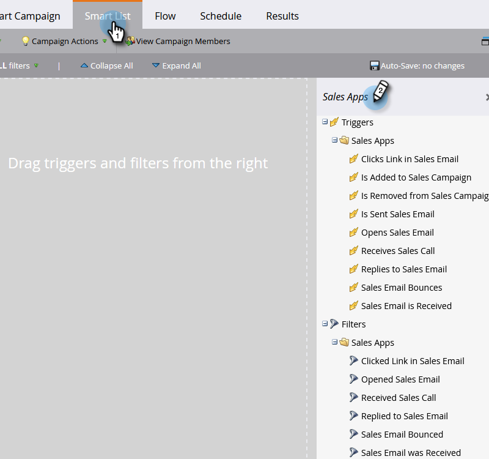

# Déclencheurs et filtres d’activité de vente {#sales-activity-triggers-and-filters}

Si vous souhaitez mieux coordonner l’engagement avec votre équipe de vente ou essayer d’obtenir une meilleure vue d’ensemble de la manière dont ils interagissent avec les clients sur le parcours des acheteurs, les informations sur les activités de vente dans Marketo seront utiles pour vous.

Suivez les étapes ci-dessous pour savoir comment utiliser les filtres et déclencheurs d’activité de vente dans vos campagnes intelligentes.

1. Recherchez et sélectionnez la campagne dynamique souhaitée.

   

1. Dans le **Liste dynamique** , recherchez &quot;Applications commerciales&quot;.

   

1. Sélectionnez un filtre ou un déclencheur et faites-le glisser dessus.

   

1. Sélectionnez les contraintes souhaitées.

   

>[!NOTE]
>
>Pour obtenir une liste complète des activités, des contraintes et des définitions, consultez notre [Glossaire de l’activité d’Insight sur les ventes](/help/marketo/product-docs/marketo-sales-insight/actions/marketo/sales-insight-actions-activity-glossary.md).
