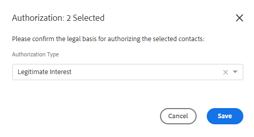

# Actions en masse sur les personnes {#bulk-actions-on-people}

Il y a quelques choses que vous pouvez faire avec vos contacts en bloc pour gagner du temps.

La première étape pour toutes les actions en bloc disponibles consiste à sélectionner deux contacts ou plus, puis à cliquer sur le point (trois points verticaux).

## Ajouter des personnes au groupe {#add-people-to-group}

Ajouter plusieurs personnes à un groupe en même temps.

## Source {#source}

Nous attribuons automatiquement une source à chaque contact qui entre dans la base de données. Utilisez cette étape pour mettre à jour cette source.

>[!NOTE]
>
>Les sources ne sont pas personnalisables.

## Autorisation {#authorization}

Conformément au [RGPD](https://eugdpr.org/), utilisez une autorisation pour indiquer comment vous avez reçu l’autorisation d’interagir avec ces contacts.

## Désabonnement {#unsubscribe}

Procédez à un désabonnement en bloc pour les contacts qui ne souhaitent plus recevoir de correspondance de votre part.

