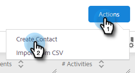

# Création et suppression de contacts {#creating-and-deleting-contacts}

## Création de contacts {#creating-contacts}

1. Sur la page Personnes, cliquez sur le bouton **Actions** et sélectionnez **Créer un contact**.

   

1. Saisissez le prénom et l’adresse électronique, ainsi que toute autre information souhaitée. Cliquez sur **Créer** une fois terminé ou **Créer et ajouter nouveau** pour ajouter d’autres contacts.

   

   >[!TIP]
   >
   >Vous souhaitez ajouter plusieurs contacts à la fois ? [Cliquez ici](/help/marketo/product-docs/marketo-sales-insight/actions/people/managing-contacts/import-contacts-via-csv.md) pour apprendre à importer des contacts via CSV.

## Suppression de contacts {#deleting-contacts}

1. Dans la page Personnes, cochez la case du contact que vous souhaitez supprimer. Cliquez sur le point (trois points verticaux) et sélectionnez **Supprimer**.

   

   >[!NOTE]
   >
   >Pour supprimer plusieurs contacts, il vous suffit de sélectionner plusieurs personnes. Les étapes restantes seraient les mêmes.

1. Cliquez sur **Supprimer le contact** pour confirmer.

   
