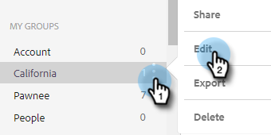

# Gestion des groupes {#manage-groups}

Découvrez comment gérer vos groupes dans les actions Sales Insight.

## Types de groupe {#group-types}

<table> 
 <colgroup> 
  <col> 
  <col> 
 </colgroup> 
 <tbody> 
  <tr> 
   <th>Groupe</th> 
   <th>Description</th> 
  </tr> 
  <tr> 
   <td>Toutes les personnes</td> 
   <td>Tous les contacts de tous les utilisateurs qui vous sont visibles.</td> 
  </tr> 
  <tr> 
   <td>Groupes dynamiques</td> 
   <td>Mes contacts : tous les contacts que vous détenez. Se désabonne : contacts qui se sont désabonnés de la réception de la correspondance.</td> 
  </tr> 
  <tr> 
   <td>Mes groupes</td> 
   <td>Groupes que vous avez créés. Ils peuvent contenir vos contacts ou des contacts qui ont été partagés avec vous.</td> 
  </tr> 
  <tr> 
   <td>Groupes d’équipes</td> 
   <td>Groupes qui ont été partagés avec et/ou par vous. Ils peuvent contenir des contacts personnels ou des contacts que vous avez partagés avec vos collègues.</td> 
  </tr> 
 </tbody> 
</table>

## Création d’un groupe {#create-a-group}

1. Dans la page Personnes, cliquez sur le **+** en regard de Groupes.

   

1. Nommez votre groupe et cliquez sur **Créer**.

   

   C&#39;est tout !

## Ajout de contacts à un groupe {#add-contacts-to-a-group}

1. Dans la page Personnes, recherchez et sélectionnez le groupe auquel vous souhaitez ajouter des personnes.

   

1. Cliquez sur **Actions de groupe** et sélectionnez **Créer un contact et ajouter au groupe**.

   

   >[!NOTE]
   >
   >Un contact à la fois sera ainsi ajouté. Pour ajouter plusieurs contacts en même temps, suivez [ces étapes](/help/marketo/product-docs/marketo-sales-insight/actions/people/managing-contacts/import-contacts-via-csv.md).

1. Renseignez les informations du contact et cliquez sur **Créer** (ou **Créer et ajouter un nouveau** pour en ajouter un autre).

   

   Et vous avez fini !

   >[!NOTE]
   >
   >Vous devrez peut-être appuyer sur Actualiser pour voir les nouveaux contacts ajoutés.

## Partage d’un groupe {#share-a-group}

1. Sur la page Personnes, recherchez et sélectionnez le groupe que vous souhaitez partager.

   

1. Cliquez sur le point (trois points verticaux) et sélectionnez **Partager**.

   

1. Cliquez sur la liste déroulante, sélectionnez l’équipe avec laquelle vous souhaitez partager le groupe et cliquez sur **Partager**.

   

   Vous êtes toujours propriétaire du groupe, mais il apparaîtra désormais sous _Groupe d’équipes_.

## Annulation du partage d’un groupe {#unshare-a-group}

1. Dans la page Personnes, recherchez et sélectionnez le groupe dont vous souhaitez annuler le partage.

   

1. Cliquez sur le point (trois points verticaux) et sélectionnez **Partager**.

   

1. Cliquez sur le **X** en regard de l’équipe avec laquelle vous avez partagé le groupe, puis cliquez en dehors du modal.

   

   Le partage du groupe est désormais annulé.

## Renommer un groupe {#rename-a-group}

1. Dans la page Personnes, recherchez et sélectionnez le groupe que vous souhaitez renommer.

   

1. Cliquez sur le point (trois points verticaux) et sélectionnez **Modifier**.

   

1. Saisissez le nouveau nom et cliquez sur **Enregistrer**.

   

## Suppression d’un groupe {#delete-a-group}

1. Dans la page Personnes, recherchez et sélectionnez le groupe à supprimer.

   

1. Cliquez sur le point (trois points verticaux) et sélectionnez **Supprimer**.

   

1. Cliquez sur **Supprimer** pour confirmer.

   
