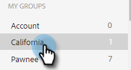

# Gérer les groupes {#manage-groups}

Découvrez comment gérer vos groupes dans [!DNL Sales Insight Actions].

## Types de groupes {#group-types}

<table>
 <colgroup>
  <col>
  <col>
 </colgroup>
 <tbody>
  <tr>
   <th>Groupe</th>
   <th>Description</th>
  </tr>
  <tr>
   <td>[!UICONTROL All People]</td>
   <td>Tous les contacts de tous les utilisateurs qui sont visibles pour vous.</td>
  </tr>
  <tr>
   <td>[!UICONTROL Dynamic Groups]</td>
   <td>Mes contacts : tous les contacts que vous possédez. Désabonnements : contacts qui se sont désabonnés de la réception de la correspondance.</td>
  </tr>
  <tr>
   <td>[!UICONTROL My Groups]</td>
   <td>Groupes que vous avez créés. Ils peuvent contenir vos contacts ou les contacts qui ont été partagés avec vous.</td>
  </tr>
  <tr>
   <td>[!UICONTROL Team Groups]</td>
   <td>Groupes qui ont été partagés avec vous et/ou par vous. Ils peuvent contenir des contacts que possèdent vos coéquipiers ou des contacts que vous avez partagés avec eux.</td>
  </tr>
 </tbody>
</table>

## Créer un groupe {#create-a-group}

1. Dans la page [!UICONTROL Personnes], cliquez sur le signe **+** en regard de [!UICONTROL Groupes].

   

1. Nommez votre groupe et cliquez sur **[!UICONTROL Créer]**.

   

   C&#39;est ça !

## Ajouter des contacts à un groupe {#add-contacts-to-a-group}

1. Dans la page [!UICONTROL Personnes], recherchez et sélectionnez le groupe auquel vous souhaitez ajouter des personnes.

   

1. Cliquez sur **[!UICONTROL Actions de groupe]** et sélectionnez **[!UICONTROL Créer un contact et ajouter au groupe]**.

   

1. Renseignez les informations du contact et cliquez sur **Créer** (ou **Créer et ajouter nouveau** pour en ajouter un autre).

   

   Et c&#39;est fini !

   >[!NOTE]
   >
   >Vous devrez peut-être cliquer sur Actualiser pour afficher les nouveaux contacts ajoutés.

## Partage d’un groupe {#share-a-group}

1. Dans la page [!UICONTROL Personnes], recherchez et sélectionnez le groupe que vous souhaitez partager.

   

1. Cliquez sur le point (trois points verticaux) et sélectionnez **[!UICONTROL Partager]**.

   

1. Cliquez sur la liste déroulante, sélectionnez l’équipe avec laquelle vous souhaitez partager le groupe, puis cliquez sur **[!UICONTROL Partager]**.

   

   Le groupe vous appartient toujours, mais il apparaît désormais sous _Groupes d’équipes_.

## Annuler le partage d’un groupe {#unshare-a-group}

1. Dans la page [!UICONTROL Personnes], recherchez et sélectionnez le groupe que vous souhaitez annuler le partage.

   

1. Cliquez sur le point (trois points verticaux) et sélectionnez **[!UICONTROL Partager]**.

   

1. Cliquez sur le **X** en regard de l’équipe avec laquelle vous avez partagé le groupe, puis cliquez sur en dehors de la boîte de dialogue modale.

   

   Le groupe n’est plus partagé.

## Renommer un groupe {#rename-a-group}

1. Dans la page [!UICONTROL Personnes], recherchez et sélectionnez le groupe à renommer.

   

1. Cliquez sur le point (trois points verticaux) et sélectionnez **[!UICONTROL Modifier]**.

   

1. Saisissez le nouveau nom et cliquez sur **[!UICONTROL Enregistrer]**.

   

## Suppression d’un groupe {#delete-a-group}

1. Dans la page Personnes , recherchez et sélectionnez le groupe à supprimer.

   

1. Cliquez sur le point (trois points verticaux) et sélectionnez **[!UICONTROL Supprimer]**.

   

1. Cliquez sur **[!UICONTROL Supprimer]** pour confirmer.

   
