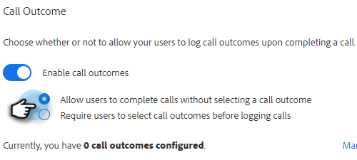

# Résultats des appels {#call-outcomes}

Autorisez vos équipes de vente à sélectionner les résultats des appels lors des appels afin que votre équipe puisse comprendre l’impact de vos efforts d’engagement client.

>[!NOTE]
>
>**Autorisations d’administrateur requises**

## Activer les résultats d’appel {#enable-call-outcomes}

1. Cliquez sur l’icône d’engrenage et sélectionnez **Paramètres**.

   

1. Sous Paramètres d’administration, sélectionnez **Numéroteur**.

   

1. Sélectionnez **Activer les résultats de l’appel**.

   

1. Choisissez l’exigence de résultat d’appel souhaitée.

   

## Créer des résultats d’appel {#create-call-outcomes}

>[!NOTE]
>
>Vous pouvez créer un maximum de 15 résultats d’appel.

1. Cliquez sur l’icône d’engrenage et sélectionnez **Paramètres**.

   

1. Sous Paramètres d’administration, sélectionnez **Numéroteur**.

   

1. Cliquez sur **Gérer les résultats de l’appel**.

   

1. Saisissez le nom du résultat de l’appel souhaité dans le champ de texte.

   

1. Cliquez sur le menu déroulant Répondu et choisissez le type de résultat (dans cet exemple, nous choisissons Répondu). Cliquez ensuite sur **Ajouter**.

   

## Choisir un résultat d’appel {#choose-a-call-outcome}

Une fois les résultats d’appel activés. Les utilisateurs peuvent en sélectionner un lors d’un appel.

1. Cliquez sur le bouton d&#39;appel pour lancer le numéroteur.

   

1. Saisissez les informations d&#39;appel dans le numéroteur et cliquez sur **Appeler**.

   

1. Sélectionnez le résultat de l’appel qui décrit le mieux l’appel.

   

1. Terminez l’appel.

   

1. Enregistrez l’appel .

   

>[!MORELIKETHIS]
>
>* [Consigner les raisons et les résultats des appels dans Salesforce](/help/marketo/product-docs/marketo-sales-insight/actions/phone/log-call-reasons-and-call-outcomes-to-salesforce.md)
>* [Raisons de l’appel](/help/marketo/product-docs/marketo-sales-insight/actions/phone/call-reasons.md)
