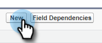

# Consigner les raisons des appels et les résultats des appels dans Salesforce {#log-call-reasons-and-call-outcomes-to-salesforce}

Si vous souhaitez consigner les résultats des appels et les raisons des appels dans Salesforce à des fins de création de rapports ou de visibilité, vous pouvez créer un champ d’activité personnalisé pour chacun d’eux. Chaque champ doit utiliser un nom d’API spécifique (appelé « Nom de champ » dans Salesforce).

* Nom de champ des résultats d’appel : motosales_call_result
* Nom de champ des motifs d’appel : motosales_call_reason

Pour utiliser ces champs, vous devez d’abord créer le champ en tant que champ d’activité personnalisé. Pour le rendre visible par les utilisateurs, vous devez l&#39;ajouter à la mise en page de l&#39;objet de la tâche.

## Salesforce Classic {#salesforce-classic}

### Créer un champ d’activité personnalisé dans Salesforce Classic  {#create-custom-activity-field-in-salesforce-classic}

1. Dans Salesforce, cliquez sur **Configuration**.

   

1. Tapez « Activités » dans la zone Recherche rapide.

   

1. Cliquez sur **Champs personnalisés d’activité**.

   

1. Cliquez sur **Nouveau**.

   

1. Sélectionnez le type de données « Texte » et cliquez sur **Suivant**.

   

1. Attribuez au champ personnalisé le nom du champ comme défini ci-dessus. La longueur du champ est limitée à 255 caractères. Le libellé du champ sera le champ visible par votre équipe des ventes et peut être personnalisé en fonction des besoins de votre équipe.

   

1. Le reste des paramètres est facultatif. Une fois la configuration terminée, cliquez sur **Suivant**.

   

1. Sélectionnez les paramètres de sécurité au niveau du champ de votre choix pour ce champ, puis cliquez sur **Suivant** (l’image ci-dessous n’est qu’un exemple).

   

   >[!NOTE]
   >
   >Assurez-vous que le champ personnalisé est visible pour le profil utilisé par vos utilisateurs d’Actions de ventes Insight, ainsi que pour tout autre élément que vous souhaitez qu’il soit visible.

1. Sélectionnez les mises en page auxquelles vous souhaitez ajouter le champ et cliquez sur **Enregistrer** (vous pouvez éventuellement cliquer sur **Enregistrer et nouveau** et répéter le processus pour le champ Motif de l’appel).

   

### Ajout d’un champ d’activité personnalisé à la disposition Page de tâche dans Salesforce Classic {#add-custom-activity-field-to-task-page-layout-in-salesforce-classic}

>[!NOTE]
>
>Vous n’aurez à suivre ces étapes que si vous n’avez pas sélectionné la mise en page souhaitée à l’étape 9 ci-dessus.

1. Dans Salesforce, cliquez sur **Configuration**.

   

1. Tapez « Tâche » dans la zone Recherche rapide.

   

1. Cliquez sur **Mises en page des tâches**.

   

1. Cliquez sur **Modifier** en regard de la mise en page de la page de la tâche à laquelle vous souhaitez ajouter ce champ.

   

1. Faites glisser et déposez le champ dans la section souhaitée de la mise en page de la tâche.

   

1. Cliquez sur **Enregistrer**

   

## Salesforce Lightning {#salesforce-lightning}

### Création d’un champ d’activité personnalisé dans Salesforce Lightning {#create-custom-activity-field-in-salesforce-lightning}

1. Dans Salesforce, cliquez sur l’icône d’engrenage en haut à droite et sélectionnez **Configuration**.

   

1. Cliquez sur **Gestionnaire d’objets**.

   

1. Tapez « Activity » dans la zone Recherche rapide.

   

1. Cliquez sur le libellé **Activité**.

   

1. Cliquez sur **Champs et relations**.

   

1. Cliquez sur **Nouveau**.

   

### Ajout d’un champ d’activité personnalisé à la mise en page de tâche dans Salesforce Lightning {#add-custom-activity-field-to-task-page-layout-in-salesforce-lightning}

1. Dans Salesforce, cliquez sur l’icône d’engrenage en haut à droite et sélectionnez **Configuration**.

   

1. Cliquez sur **Gestionnaire d’objets**.

   

1. Tapez « Tâche » dans la zone Recherche rapide.

   

1. Cliquez sur le libellé **Tâche**.

   

1. Cliquez sur **Dispositions de page**.

   

1. Cliquez sur la mise en page de la page de la tâche à laquelle vous souhaitez ajouter ce champ.

   

1. Faites glisser et déposez le champ dans la section souhaitée de la mise en page de la tâche.

   

1. Cliquez sur **Enregistrer**

   

>[!MORELIKETHIS]
>
>* [Résultats des appels](/help/marketo/product-docs/marketo-sales-insight/actions/phone/call-outcomes.md)
>* [Raisons de l’appel](/help/marketo/product-docs/marketo-sales-insight/actions/phone/call-reasons.md)
