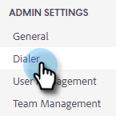
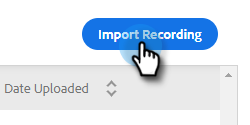

# Paramètres de consentement des deux parties {#two-party-consent-settings}

Afin de garantir la conformité aux lois américaines sur le consentement bipartite lors de l’enregistrement des appels, en tant qu’administrateur, vous pouvez activer la lecture d’un message préenregistré de votre choix au début de vos appels lors de l’enregistrement.

>[!PREREQUISITES]
>
>Avant de suivre les étapes ci-dessous, vous devez d’abord [&#x200B; activer l’enregistrement des appels &#x200B;](/help/marketo/product-docs/marketo-sales-insight/actions/phone/enable-call-recording.md).

1. Cliquez sur l’icône Paramètres et sélectionnez **[!UICONTROL Paramètres]**.

   

1. Sous [!UICONTROL Paramètres d’administration], cliquez sur **[!UICONTROL Général]**.

   

1. Dans la vignette [!UICONTROL Enregistrement des appels], cliquez sur **[!UICONTROL Gérer l’avis d’enregistrement]**.

   

1. Cliquez sur **[!UICONTROL Importer l’enregistrement]**.

   

   >[!NOTE]
   >
   >Seuls les fichiers Wav et MP3 sont pris en charge. Vous ne pouvez pas charger un fichier de plus de 30 secondes.

1. Sélectionnez le ou les fichiers audio souhaités sur votre disque dur.

   

1. Une fois le chargement terminé, sélectionnez le point (trois points) dans le gestionnaire de fichiers et cliquez sur **[!UICONTROL Sélectionner en tant qu’avis de consentement]**. Cliquez sur **[!UICONTROL OK]** lorsque vous avez terminé.

   

1. Cliquez sur le bouton (bascule) pour activer la lecture du message sélectionné au début de vos appels enregistrés.

   
