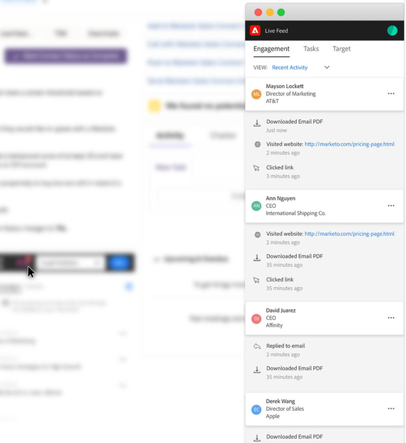

# Présentation de la fonctionnalité Actions de Sales Insight {#msi-actions-feature-overview}

Accélérez les efforts de prospection grâce à des outils d’engagement et d’intelligence basés sur le marketing réunis en un seul workflow à l’aide des actions Sales Insight.

>[!NOTE]
>
>Marketo Sales Insight Actions est une application web qui s’intègre exclusivement au CRM Salesforce via le package [Marketo Sales Insight](/help/marketo/product-docs/marketo-sales-insight/msi-for-salesforce/installation/install-marketo-sales-insight-package-in-salesforce-appexchange.md){target="_blank"}. Il est parfois appelé « Ventes Marketo » ou simplement « Actions ».

Pour un aperçu vidéo des actions Sales Insight, [cliquez ici](https://experienceleague.adobe.com/docs/marketo-learn/tutorials/sales-insight-actions/overview.html?lang=fr){target="_blank"}.

## Mise en page du lead et mise en page du contact {#lead-layout-and-contact-layout}

Les actions suivantes sont disponibles à partir du menu déroulant « Choisir des actions » dans le volet de navigation supérieur :

* Envoyer un e-mail de vente
   * Les e-mails de vente ont un suivi des vues, clics et réponses (lorsque le canal de diffusion est configuré)
   * Inclut le Personalization de messagerie électronique, la signature personnalisée et les pièces jointes
   * Partage de modèles et rapports
   * Partage d’équipes, e-mails de groupe et fonctionnalité CC/Cci
   * L’activité E-mail de vente sera consignée dans l’enregistrement de personne Marketo
   * Filtres et triggers correspondants dans les campagnes intelligentes Marketo (détails ci-dessous)

* Ajouter à la campagne de ventes
   * Ajouter des prospects aux playbooks de vente qui sont une séquence d’e-mails et de tâches
   * Inclut l’accès et le partage des équipes, la génération de tâches, l’omission des week-ends, l’exclusion des réponses des e-mails OOO et la fin automatique
   * L’activité de campagne sera consignée dans l’enregistrement de personne Marketo
   * Filtres et triggers correspondants dans les campagnes intelligentes Marketo (détails ci-dessous)

* Appel de vente
   * Effectuer des appels commerciaux à l’aide du composeur dans le CRM
   * Inclut la présence locale, pré-enregistrée
   * Consigner le résultat de l’appel, l’enregistrement des appels dans le panneau et l’historique des activités
   * L’activité d’appel sera consignée dans l’enregistrement de personne Marketo
   * Filtres et triggers dans les campagnes intelligentes Marketo

* Ajouter une tâche
   * Créer des tâches personnalisées, d’e-mail, d’appel et InMail pour vos prospects
   * Automatiser la création de tâches avec des campagnes de vente
   * Synchroniser les tâches avec [!DNL Salesforce]
   * Consigner les tâches dans [!DNL Salesforce] section Historique des activités

Vous pouvez accéder au flux en direct en cliquant sur l’icône (0) dans le volet de navigation supérieur. Il offre la possibilité de voir les mises à jour en direct des activités de vente, ainsi que la fonctionnalité d’ancrage d’écran.

Les données suivantes sont disponibles dans les onglets du panneau MSI :

* Tableau de bord des informations
   * La grille Vitesse de l’engagement comprend les activités des e-mails de vente, des actions de campagne des ventes et des appels aux ventes
   * Campagnes de vente à venir : lorsqu’un prospect fait partie d’une campagne en cours, ces informations sont disponibles dans l’onglet Campagnes de vente à venir
   * Tâches à venir - Lorsqu’une tâche relative à un prospect est à venir, ces informations sont disponibles dans l’onglet des tâches à venir

* Onglet E-mail
   * Tous les e-mails de vente envoyés seront consignés ici. Les activités seront également consignées dans l’enregistrement de personne Marketo
   * Les colonnes comprennent l’objet, l’ouverture, le clic, la réponse (disponible uniquement pour les e-mails de vente avec configuration du canal de diffusion), l’expéditeur et la date
   * Inclut la carte déroulante avec des détails supplémentaires tels que l’expéditeur, le modèle, la campagne commerciale et l’e-mail de prévisualisation

* Onglet Appel
   * Tous les appels effectués à l&#39;aide de la fonction Numéroteur commercial seront consignés ici. Les activités seront également consignées dans l’enregistrement de personne Marketo
   * Les colonnes comprennent le nom, le résultat, les notes, le jour de l’appel, la durée et le lien vers l’enregistrement
   * Inclut la carte déroulante avec des détails supplémentaires tels que l’appel effectué par, l’appel répondu par, le numéro de téléphone et le statut

## Mise en page du compte et de l’opportunité {#account-and-opportunity-layout}

Les actions suivantes sont disponibles à partir du volet de navigation supérieur :

* Envoyer un e-mail de vente : possibilité d’envoyer des e-mails de groupe personnalisés ou modélisés avec un suivi des affichages, des clics et des réponses à tous les contacts associés à un compte/une opportunité
   * Les e-mails de vente ont un suivi des vues, clics et réponses (lorsque le canal de diffusion est configuré)
   * Inclut le Personalization de messagerie électronique, la signature personnalisée et les pièces jointes
   * Partage de modèles et rapports
   * Partage d’équipes, e-mails de groupe et fonctionnalité CC/Cci
   * L’activité E-mail de vente sera consignée dans l’enregistrement de personne Marketo
   * Filtres et triggers correspondants dans les campagnes intelligentes Marketo (détails ci-dessous)

* Ajouter à la campagne de vente : ajoutez tous les contacts associés à un compte/une opportunité aux playbooks de vente qui consistent en une séquence d’e-mails et de tâches
   * Ajouter des prospects aux playbooks de vente qui sont une séquence d’e-mails et de tâches
   * Inclut l’accès et le partage des équipes, la génération de tâches, l’omission des week-ends, l’exclusion des réponses des e-mails OOO et la fin automatique
   * L’activité de campagne sera consignée dans l’enregistrement de personne Marketo
   * Filtres et triggers correspondants dans les campagnes intelligentes Marketo (détails ci-dessous)

Vous pouvez accéder au flux en direct en cliquant sur l’icône (0) dans le volet de navigation supérieur. Il offre la possibilité de voir les mises à jour en direct des activités de vente, ainsi que la fonctionnalité d’ancrage d’écran.

Les données disponibles dans les onglets sont les suivantes :

* Tableau de bord des informations
   * La grille Vitesse de l’engagement comprend les activités des e-mails de vente, des actions de campagne des ventes et de l’appel de ventes
   * Campagnes de vente à venir : lorsqu’un contact du compte/de l’opportunité fait partie d’une campagne en cours, ces informations sont disponibles dans l’onglet Campagnes de vente à venir .
   * Tâches à venir : lorsqu’une tâche relative à un contact du compte/de l’opportunité est à venir, ces informations sont disponibles dans l’onglet des tâches à venir

* Onglet E-mail
   * Tous les e-mails de vente envoyés aux contacts du compte/de l’opportunité seront consignés ici. Les activités seront également consignées dans l’enregistrement de personne Marketo
   * Les colonnes comprennent l’objet, l’ouverture, le clic, la réponse (disponible uniquement pour l’e-mail de vente avec configuration du canal de diffusion), l’expéditeur et la date
   * Inclut la carte déroulante avec des détails supplémentaires tels que l’expéditeur, le modèle, la campagne commerciale et l’e-mail de prévisualisation

* Onglet Appel
   * Tous les appels effectués aux contacts du compte/de l’opportunité à l’aide de la fonctionnalité de numérotation des ventes seront consignés ici. Les activités seront également consignées dans l’enregistrement de personne Marketo
   * Les colonnes comprennent le nom, le résultat, les notes, le moment de l’appel, la durée et le lien vers l’enregistrement
   * Inclut la carte déroulante avec des détails supplémentaires tels que l’appel effectué par, l’appel répondu par, le numéro de téléphone et le statut

## Vue Liste des leads et des contacts (actions en bloc) {#lead-and-contact-list-view}

* [!UICONTROL Envoyer un e-mail de vente] - Possibilité d’envoyer des e-mails personnalisés ou modélisés avec suivi des vues, des clics et des réponses à une liste de contacts/prospects
* [!UICONTROL Ajouter à la campagne de ventes] - Ajoutez aux playbooks de ventes qui consiste en une séquence d’e-mails et de tâches à une liste de contacts/prospects

## Onglet global Marketo {#marketo-global-tab}

**[!UICONTROL Onglet Meilleurs &#x200B;]**

Les actions en masse suivantes sont disponibles à partir de la liste déroulante de l’onglet [!UICONTROL &#x200B; Meilleurs résultats &#x200B;] :

* [!UICONTROL Envoyer un e-mail de vente] - Possibilité d’envoyer des e-mails personnalisés ou modélisés avec suivi des vues, clics et réponses
* [!UICONTROL Ajouter à la campagne de vente] - Ajoutez des prospects aux playbooks de vente qui consistent en une séquence d’e-mails et de tâches

  

Les actions en ligne suivantes sont disponibles pour les leads/contacts individuels dans l’onglet [!UICONTROL &#x200B; Meilleurs résultats &#x200B;] :

* [!UICONTROL Envoyer un e-mail de vente] - Possibilité d’envoyer des e-mails personnalisés ou modélisés avec suivi des vues, clics et réponses
* [!UICONTROL Ajouter à la campagne de vente] - Ajoutez des prospects aux playbooks de vente qui consistent en une séquence d’e-mails et de tâches
* [!UICONTROL Appel de vente] - Effectuez des appels de vente à l’aide du composeur dans le CRM
* [!UICONTROL Ajouter une tâche] - Créez des tâches d’e-mail, d’appel, de client ou LinkedIn pour les prospects

  

**Onglet Email**

* Tous les e-mails de vente envoyés seront consignés ici. Les activités seront également consignées dans l’enregistrement de personne Marketo
* Les colonnes comprennent l’objet, l’ouverture, le clic, la réponse (disponible uniquement pour l’e-mail de vente avec configuration du canal de diffusion), l’expéditeur et la date
* Inclut la carte déroulante avec des détails supplémentaires tels que l’expéditeur, le modèle, la campagne commerciale et l’e-mail de prévisualisation

**Onglet Appel**

* Tous les appels effectués à l&#39;aide de la fonction Numéroteur commercial seront consignés ici. Les activités seront également consignées dans l’enregistrement de personne Marketo
* Les colonnes comprennent le nom, le résultat, les notes, le moment de l’appel, la durée et le lien vers l’enregistrement
* Inclut la carte déroulante avec des détails supplémentaires tels que l’appel effectué par, l’appel répondu par, le numéro de téléphone et le statut

**Onglet Tâche**

* Les tâches créées et terminées (e-mail, appel, courrier électronique et personnalisées) seront disponibles pour la gestion des tâches dans cet onglet. Inclut la possibilité d’ajouter une tâche
* Automatiser la création de tâches avec des campagnes de vente
* Synchroniser les tâches avec [!DNL Salesforce]
* Consigner les tâches dans [!DNL Salesforce] section Historique des activités

  

**Flux en direct**

* Possibilité de voir les mises à jour en direct des activités de vente avec la fonctionnalité d’ancrage d’écran
* Les boutons d’e-mail, d’appel et de cadence intégrés rendent chaque client insight exploitable

## Fonctionnalités disponibles dans Marketo {#features-available-in-marketo}

Activités de vente capturées dans Marketo :

* Envoyer un e-mail commercial : l’utilisateur a envoyé un e-mail commercial à un prospect
* Ouvrir l’e-mail de vente - Le prospect a ouvert un e-mail de vente envoyé
* Clic sur l’e-mail de vente - Le prospect a cliqué sur un lien dans un e-mail de vente
* E-mail de vente répondu - Le prospect a répondu à un e-mail de vente
* Recevoir un appel de vente : le prospect a reçu un appel d’un vendeur à l’aide de l’appel de vente.
* Ajouter à la campagne de ventes - Le prospect a été ajouté à une campagne de ventes créée
* Supprimé de la campagne de ventes - Le prospect a été supprimé d&#39;une campagne de ventes créée

Les filtres et triggers sont les suivants :

* [!UICONTROL E-mail de vente envoyé]
* [!UICONTROL Ouvre l&#39;e-mail de vente]
* [!UICONTROL Clics sur l’e-mail de vente]
* [!UICONTROL Réponses aux e-mails de ventes]
* [!UICONTROL Reçoit un appel de vente]
* [!UICONTROL Ajoutée à la campagne de ventes]
* [!UICONTROL Supprimé de la campagne de ventes]

  
