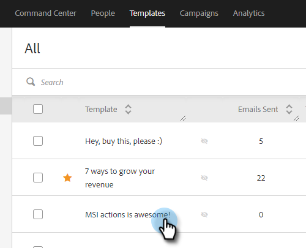

# Ajouter un lien hypertexte {#add-hyperlinked-text}

Suivez les étapes ci-dessous pour savoir comment ajouter des liens hypertexte à vos modèles d’e-mail.

1. Sur la page [!UICONTROL Modèles], sélectionnez le modèle souhaité (ou créez-en un).

   

1. Cliquez sur **[!UICONTROL Modifier]**.

   

1. Tapez le texte à lier par un lien hypertexte (par exemple, « Cliquez ici »). [!DNL Highlight]-le, puis cliquez sur le bouton lien dans l’éditeur.

   

1. Saisissez l’URL à laquelle vous souhaitez qu’il soit lié (c’est-à-dire `https://experienceleague.adobe.com/docs/marketo/using/home.html`). Choisissez si vous souhaitez que l’URL s’ouvre dans la même fenêtre ou dans une nouvelle, puis cliquez sur **[!UICONTROL Enregistrer]**.

   

1. Cliquez de nouveau sur **[!UICONTROL Enregistrer]**.

   

>[!NOTE]
>
>Si le modèle que vous modifiez est actuellement utilisé comme étape d’e-mail dans une campagne, vous aurez la possibilité de mettre à jour le libellé pour des campagnes spécifiques (ou toutes).
