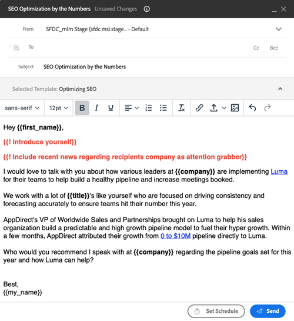

# Prompts de champs {#field-prompts}

Les invites de champ vous permettent d&#39;ajouter une chaîne de texte aux e-mails qui doivent être supprimés ou remplacés avant l&#39;envoi de l&#39;e-mail. Il s’agit d’un excellent moyen de rappeler aux utilisateurs d’ajouter une personnalisation supplémentaire.

Pour ajouter une invite de champ, saisissez le texte souhaité. Faites-la précéder d&#39;un point d&#39;exclamation et entourez-la de crochets (voir ci-dessous).

**Exemples :**

`{{! Introduce yourself}}`

`{{! Insert name of Account Executive}}`

`{{! Add sentence that references their industry and role}}`

Les utilisateurs devront remplacer ce texte par leur propre personnalisation avant que l’e-mail ne puisse être envoyé.

>[!NOTE]
>
>Lors de l’utilisation d’invites avec des campagnes de vente, il est préférable de les utiliser avec des étapes d’email manuelles. Ces étapes attribuent à l’utilisateur une tâche de rappel pour envoyer l’e-mail, ce qui lui permet de remplacer les invites par du texte personnalisé. Les étapes d’envoi automatique par e-mail dans les campagnes de ventes tenteront d’envoyer automatiquement , sans permettre à l’utilisateur de remplacer les invites. Les invites qui ne sont pas remplacées entraînent l&#39;échec de l&#39;envoi des emails.
