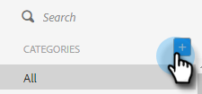

# Gérer les catégories de modèles {#manage-template-categories}

## Créer une catégorie {#create-a-category}

1. Cliquez sur l’onglet **[!UICONTROL Modèles]**.

   

1. Cliquez sur l’icône **+** en regard de **[!UICONTROL Catégories]**.

   

1. Saisissez un nom pour votre nouvelle catégorie, puis cliquez sur **[!UICONTROL Créer]**.

   

## Renommer une catégorie de modèle {#rename-a-template-category}

1. Cliquez sur l’onglet **[!UICONTROL Modèles]**.

   

1. Pointez sur le modèle à renommer, puis cliquez sur le point (trois points). Sélectionnez **[!UICONTROL Renommer]**.

   

1. Saisissez le nouveau nom. Appuyez sur Entrée (ou cliquez simplement ailleurs sur l&#39;écran) pour enregistrer.

   

## Suppression d’une catégorie de modèles {#delete-a-template-category}

1. Cliquez sur l’onglet **[!UICONTROL Modèles]**.

   

1. Pointez sur le modèle à renommer, puis cliquez sur le point (trois points). Sélectionnez **[!UICONTROL Supprimer]**.

   

1. Cliquez sur **[!UICONTROL Supprimer]** pour confirmer.

   

>[!NOTE]
>
>Les catégories ne peuvent pas être supprimées si elles contiennent des modèles. Déplacez ou supprimez tous les modèles avant de supprimer une catégorie.
