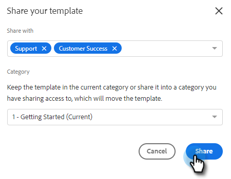
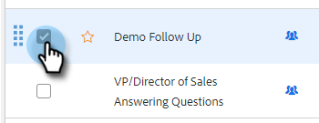

# Gérer les modèles {#manage-templates}

## Création d’un modèle {#create-a-new-template}

1. Accédez à l’onglet **[!UICONTROL Modèles]**.

   

1. Cliquez sur **[!UICONTROL Créer un modèle]**.

   

1. Choisissez un **[!UICONTROL Nom]** et un **[!UICONTROL Catégorie]** pour votre modèle d’e-mail, puis cliquez sur **[!UICONTROL Créer]**.

   

1. Dans l’éditeur de modèles, créez une ligne d’objet pour votre e-mail et saisissez le message souhaité. Utilisez les outils d’édition (police, taille du texte, etc.) pour personnaliser l’aspect. Cliquez sur **[!UICONTROL Enregistrer]** pour finaliser vos modifications.

   

>[!TIP]
>
>Saisissez toujours du texte directement dans le modèle ou copiez-le à partir d’un éditeur de texte brut (par exemple, [!DNL Notepad] ou [!DNL TextEdit]). La copie et le collage d’un éditeur de texte enrichi (par exemple, MS [!DNL Word]) peuvent entraîner des irrégularités de mise en forme.

## Afficher les détails du modèle {#view-template-details}

La zone Détails du modèle contient plusieurs onglets.

<table>
 <tr>
  <td><strong>[!UICONTROL Template]</strong></td>
  <td>Vérifier et apporter des modifications, configurer des critères pour faire du modèle un modèle recommandé, ajouter des notes</td>
 </tr>
 <tr>
  <td><strong>Analytics</strong></td>
  <td>Examinez les analyses d’engagement pour le modèle. Effectuez une recherche filtrée.</td>
 </tr>
 <tr>
  <td><strong>[!UICONTROL Emails]</strong></td>
  <td>Afficher tous les e-mails envoyés à l’aide de ce modèle. Effectuez une recherche filtrée.</td>
 </tr>
 <tr>
  <td><strong>[!UICONTROL Campagnes]</strong></td>
  <td>Identifiez les campagnes dans lesquelles le modèle est utilisé.</td>
 </tr>
</table>

## Partage d’un modèle {#share-a-template}

Si vous utilisez l&#39;un de nos comptes d&#39;équipe, tous vos modèles restent privés par défaut.

1. Accédez à l’onglet **[!UICONTROL Modèles]**.

   

1. Recherchez et choisissez le modèle souhaité.

   

1. Cliquez sur le bouton **[!UICONTROL Partager]**.

   

   >[!NOTE]
   >
   >Les modèles qui ont été partagés avec vous s’affichent sous l’en-tête **[!UICONTROL Modèles d’équipe]** sur le côté gauche de la page [!UICONTROL Modèles]. Les équipes ne sont disponibles que pour les utilisateurs Premium.

1. Cliquez sur le menu déroulant [!UICONTROL Partager avec] et sélectionnez la ou les équipes avec lesquelles vous souhaitez partager.

   

1. Vous avez la possibilité de conserver le modèle dans la catégorie actuelle ou de le déplacer vers une autre catégorie. Dans cet exemple, nous le conservons dans le modèle actuel. Cliquez sur **[!UICONTROL Partager]** lorsque vous avez terminé.

   

## Mettre un modèle en favori {#favorite-a-template}

Vous pouvez ajouter des modèles de n’importe quelle catégorie à votre liste Favoris. Cela génère automatiquement une nouvelle catégorie en haut de votre liste afin que vous puissiez rapidement accéder aux modèles que vous utilisez le plus.

1. Accédez à l’onglet **[!UICONTROL Modèles]**.

   

1. Recherchez le modèle souhaité et passez la souris dessus. Cliquez sur l’étoile qui s’affiche à gauche du nom du modèle.

   

   Une fois qu&#39;elle sera mise en favori, l&#39;étoile restera.

   

## Personnaliser la vue du modèle {#customize-template-view}

Dans la liste déroulante **[!UICONTROL Affichage]**, vous pouvez choisir d’afficher : tous les modèles, vos modèles, vos modèles favoris, les modèles partagés, les modèles non partagés ou les modèles non utilisés (modèles qui n’ont pas été utilisés au cours des 90 derniers jours).

>[!NOTE]
>
>De plus, vous pouvez ajouter/supprimer des colonnes dans votre vue de modèle en cliquant sur l’icône des paramètres à droite de la liste déroulante de la vue.

## Archiver un modèle {#archive-a-template}

Archivez les modèles pour que le contenu de vos ventes reste organisé et ciblé sans perdre aucune donnée de modèle.

1. Cochez la case en regard du modèle à archiver.

   

1. Cliquez sur **[!UICONTROL Archiver]**.

   

1. Cliquez sur **[!UICONTROL Archiver]** pour confirmer.

   

>[!NOTE]
>
>Une fois un modèle archivé, il ne peut plus être modifié ni utilisé. Pour l’utiliser à nouveau, déplacez le modèle hors de l’archive et le placez dans une autre catégorie.

Vous pouvez également sélectionner le filtre Inutilisé pour afficher et archiver les modèles qui n’ont pas été utilisés depuis plus de 90 jours.

## Suppression d’un modèle {#delete-a-template}

Pour supprimer un modèle, procédez comme suit.

>[!CAUTION]
>
>La suppression d’un modèle supprime également TOUS les suivis et analyses qui y sont associés.

1. Cochez la case en regard du modèle à supprimer.

   

1. Cliquez sur **[!UICONTROL Supprimer]**.

   

1. Cliquez sur **[!UICONTROL Supprimer]** pour confirmer.

   
