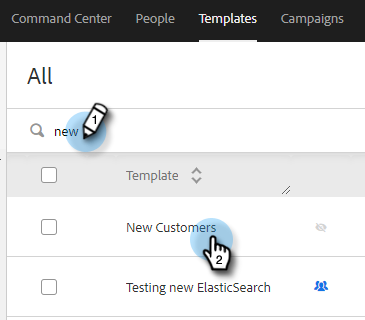

# Gérer les modèles {#manage-templates}

## Création d’un modèle {#create-a-new-template}

1. Accédez à l’onglet **Modèles** .

   

1. Cliquez sur **Créer un modèle**.

   

1. Choisissez un **nom** et une **catégorie** pour votre modèle de courrier électronique, puis cliquez sur **Créer**.

   

1. Dans l’éditeur de modèles, créez un objet pour votre email et saisissez le message de votre choix. Utiliser les outils d&#39;édition (police, taille du texte, etc.) pour personnaliser l’aspect. Cliquez sur **Enregistrer** pour finaliser vos modifications.

   

>[!TIP]
>
>Saisissez toujours du texte directement dans le modèle ou effectuez une copie à partir d’un éditeur de texte brut (Bloc-notes ou TextEdit, par exemple). La copie et le collage à partir d’un éditeur de texte enrichi (par exemple, MS Word) peuvent entraîner des irrégularités de mise en forme.

## Afficher les détails du modèle {#view-template-details}

La zone Détails du modèle contient plusieurs onglets.

<table>
 <tr>
  <td><strong>Modèle</strong></td>
  <td>Réviser et apporter des modifications, configurer des critères pour faire du modèle un modèle recommandé, ajouter des notes</td>
 </tr>
 <tr>
  <td><strong>Analytics</strong></td>
  <td>Examinez les analyses de l’engagement pour le modèle. Effectuez une recherche filtrée.</td>
 </tr>
 <tr>
  <td><strong>E-mails</strong></td>
  <td>Afficher tous les emails envoyés à l'aide de ce modèle. Effectuez une recherche filtrée.</td>
 </tr>
 <tr>
  <td><strong>Campagnes</strong></td>
  <td>Identifiez les campagnes dans lesquelles le modèle est utilisé.</td>
 </tr>
</table>

## Partage d’un modèle {#share-a-template}

Si vous utilisez l’un de nos comptes d’équipe, tous vos modèles restent privés par défaut.

1. Accédez à l’onglet **Modèles** .

   

1. Recherchez et sélectionnez le modèle de votre choix.

   

1. Cliquez sur le bouton **Partager** .

   

   >[!NOTE]
   >
   >Les modèles qui ont été partagés avec vous s’affichent sous l’en-tête **Modèles d’équipe** sur le côté gauche de la page Modèles. Les équipes ne sont disponibles que pour les utilisateurs Premium.

1. Cliquez sur la liste déroulante Partager avec et sélectionnez la ou les équipes avec lesquelles vous souhaitez partager.

   

1. Vous avez la possibilité de conserver le modèle dans la catégorie actuelle ou de le déplacer vers une autre catégorie. Dans cet exemple, nous le conservons dans la version actuelle. Cliquez sur **Partager** lorsque vous avez terminé.

   

## Favori d’un modèle {#favorite-a-template}

Vous pouvez ajouter des modèles de n’importe quelle catégorie à votre liste Favoris. Cette opération génère automatiquement une nouvelle catégorie en haut de votre liste afin que vous puissiez accéder rapidement aux modèles que vous utilisez le plus.

1. Accédez à l’onglet **Modèles** .

   

1. Recherchez le modèle souhaité et survolez-le avec la souris. Cliquez sur l’étoile qui s’affiche à gauche du nom du modèle.

   

   Une fois qu&#39;elle sera préférée, l&#39;étoile restera.

   

## Personnalisation de l’affichage des modèles {#customize-template-view}

Dans la liste déroulante **Affichage**, vous pouvez choisir d’afficher : tous les modèles, vos modèles, vos modèles favoris, les modèles partagés, les modèles non partagés ou les modèles inutilisés (modèles qui n’ont pas été utilisés au cours des 90 derniers jours).

>[!NOTE]
>
>De plus, vous pouvez ajouter/supprimer des colonnes dans la vue de modèle en cliquant sur l’icône de paramètres située à droite de la liste déroulante des vues.

## Archivage d’un modèle {#archive-a-template}

Archivez des modèles pour organiser et cibler le contenu de vos ventes sans perdre les données de modèle.

1. Cochez la case en regard du modèle que vous souhaitez archiver.

   

1. Cliquez sur **Archiver**.

   

1. Cliquez sur **Archiver** pour confirmer.

   

>[!NOTE]
>
>Une fois qu’un modèle est archivé, il ne peut pas être modifié ni utilisé. Pour l’utiliser à nouveau, déplacez le modèle hors d’Archive et dans toute autre catégorie.

Vous pouvez également sélectionner le filtre Inutilisé pour afficher et archiver les modèles qui n’ont pas été utilisés depuis plus de 90 jours.

## Suppression d’un modèle {#delete-a-template}

Suivez les étapes ci-dessous pour supprimer un modèle.

>[!CAUTION]
>
>La suppression d’un modèle entraîne également la suppression de TOUS les outils de suivi et d’analyse qui lui sont associés.

1. Cochez la case en regard du modèle que vous souhaitez supprimer.

   

1. Cliquez sur **Supprimer**.

   

1. Cliquez sur **Supprimer** pour confirmer.

   
