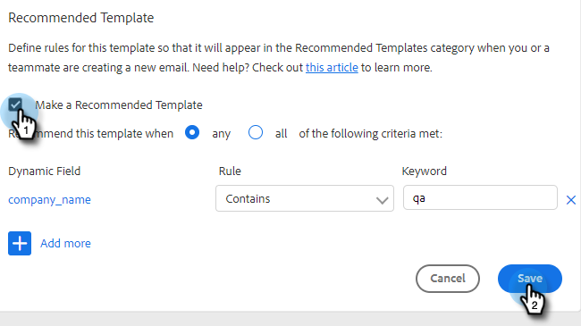

# Modèles recommandés {#recommended-templates}

Les modèles recommandés par [!DNL Sales Insight Action] vous aident à obtenir les bons messages tout en vous faisant gagner du temps. Vous bénéficiez ainsi d’un plus grand flux lors de l’envoi d’e-mails et réduisez l’incertitude lors de la recherche de l’e-mail approprié pour la bonne personne.

1. Accédez à l’onglet **[!UICONTROL Modèles]**.

   

1. Sélectionnez le modèle que vous souhaitez recommander.

   

1. Dans la vignette [!UICONTROL  Modèle recommandé ], cliquez sur **[!UICONTROL Modifier]**.

   

1. Cochez la case **[!UICONTROL Créer un modèle recommandé]** puis cliquez sur **[!UICONTROL Enregistrer]**.

   

>[!NOTE]
>
>Pour en savoir plus sur les critères de modèle, voir ci-dessous.

## Tous vs. {#all-vs-any}

Sélectionnez **[!UICONTROL Tous]** si vous souhaitez que votre modèle soit recommandé lorsque tous les critères sont remplis. Sélectionnez **[!UICONTROL N’importe lequel]** si vous souhaitez que votre modèle soit recommandé lorsqu’un des critères est satisfait.

## Définition de critères {#setting-criteria}

Vos critères vont définir les conditions pour lesquelles les modèles seront recommandés. Vous pouvez définir un maximum de 3 critères. Sélectionnez d’abord les champs dynamiques sur lesquels vous souhaitez pointer dans votre modèle.

## Conditions {#conditions}

Sélectionnez maintenant votre condition. Lorsque les conditions de votre champ dynamique sont remplies, le modèle est recommandé. Choisissez parmi 4 conditions différentes.

**[!UICONTROL Equals]** : la valeur doit être une correspondance exacte (par exemple, Marketo est égal à Marketo).

**[!UICONTROL N’est pas égal à]** : la valeur doit être tout sauf une correspondance exacte (par exemple, Nation marketing n’est pas égal à Marketing).

**[!UICONTROL Contient]** : ne doit contenir que la valeur (par exemple, Marketo Rocks ! contient Marketo)

**[!UICONTROL Ne contient pas]** : la valeur ne doit pas se trouver dans le champ dynamique (par exemple, Marketo Rocks ! ne contient pas (Awesome)

## À Quoi Ressemble Un Modèle Recommandé {#what-a-recommended-template-looks-like}

Maintenant que vous avez mappé votre premier modèle, il est temps de mapper le reste. Parcourez vos modèles les plus réussis et recommandez-les. N’oubliez pas de partager le modèle avec votre équipe également. Vos paramètres recommandés pour tous les modèles seront également partagés avec votre équipe.
