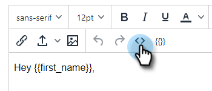

# Utilisation d’HTML {#using-html}

1. Copiez le code source de vos emails dans l’outil que vous utilisez pour créer des emails dans HTML (par exemple, Marketo Email Editor).

1. Sélectionnez le modèle auquel vous souhaitez ajouter l’HTML.

   

1. Dans la carte Éditeur de modèles , cliquez sur **Modifier**.

   

1. Cliquez sur le bouton **Source** dans votre éditeur de modèles.

   

1. Collez le code source et cliquez sur **Enregistrer**.

   

>[!NOTE]
>
>Si l’erreur &quot;Erreur - pour supprimer les balises style/java/html&quot; s’affiche, cela signifie que vous disposez d’un style que nous ne prenons pas en charge. Vous devez rechercher le style du mot dans le code Source et tout supprimer de ``.
