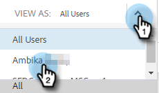

# Afficher la liste des modèles en tant qu’un autre utilisateur ou une autre utilisatrice {#view-template-list-as-another-user}

En tant qu’administrateur, vous pouvez afficher les modèles comme n’importe quel utilisateur.

>[!NOTE]
>
>**Autorisations d’administration requises**

1. Cliquez sur **[!UICONTROL Modèles]**.

   

1. Cliquez sur le menu déroulant **[!UICONTROL Afficher sous]** et sélectionnez l’utilisateur de votre choix.

   

1. Vous affichez désormais les modèles en tant qu’utilisateur sélectionné.

   

   >[!NOTE]
   >
   >Vous pouvez également utiliser les filtres ou la fonction de recherche avec _[!UICONTROL Afficher sous]_ pour afficher ce qui vous intéresse le plus.
