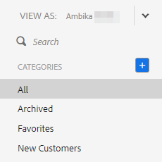

# Affichage de la liste de modèles en tant qu’autre utilisateur {#view-template-list-as-another-user}

En tant qu’administrateur, vous pouvez afficher les modèles comme n’importe quel utilisateur.

>[!NOTE]
>
>**Autorisations d’administrateur requises**

1. Cliquez sur **Modèles**.

   

1. Cliquez sur la liste déroulante **Afficher comme** et sélectionnez un utilisateur.

   

1. Vous affichez maintenant les modèles en tant qu’utilisateur sélectionné.

   

   >[!NOTE]
   >
   >Vous pouvez également utiliser des filtres ou la fonction de recherche avec _Afficher sous_ pour afficher ce qui vous intéresse le plus.
