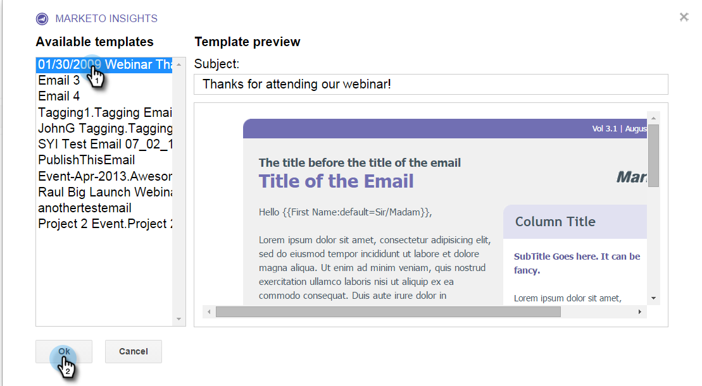

# Utilisation de Marketing Cloud Insights pour Google Chrome {#using-marketo-insights-for-google-chrome}

Envoyez et effectuez le suivi de tout courrier électronique Google avec Marketo Insights pour Google Chrome.

>[!NOTE]
>
>**Conditions préalables**
>
>* [Installation de Marketo Insights pour Google Chrome](install-marketo-insights-for-google-chrome.md)

>

## Envoyer un courriel avec les statistiques de marketing {#send-an-email-with-marketo-insights}

1. Dans la fenêtre Composer, cliquez sur l’icône Marqueur.

   

1. Le bouton Envoyer est devenu Marketo violet ! Ce courriel sera maintenant envoyé avec Marketo, tous les liens seront suivis et un pixel de suivi sera inséré dans le courriel. Cette activité sera enregistrée comme courriel de vente envoyé.

   

   >[!NOTE]
   >
   >Un pixel de suivi vous permet de savoir qui a ouvert votre courriel.

   >[!TIP]
   >
   >Si vous le souhaitez, cliquez sur la flèche de doublon pour passer à une vue en plein écran.

1. Si vous souhaitez préremplir votre courrier électronique avec un modèle Marketo publié, cliquez sur **Plus d’options** et sélectionnez **Charger le modèle Marketo.**

   

1. Sélectionnez un modèle **** Disponible et cliquez sur **Ok.**

   

1. Saisissez votre contenu, une adresse électronique, puis cliquez sur **Envoyer**.

   

   >[!NOTE]
   >
   >Le suivi des messages s’effectue uniquement lorsque le bouton **Envoyer** est violet.

1. Le courrier électronique s’affichera bientôt dans votre aperçu des ventes de Marketing Cloud et tous les ouvertures et clics seront suivis.

   

## Enregistrer les réponses par courriel avec Marketo {#log-email-replies-with-marketo}

Vous pouvez consigner les réponses et les anciennes activités dans l&#39;historique des activités d&#39;un prospect.

1. Dans le volet de prévisualisation de Google Mail, cliquez sur **Log with Marketo (Journal avec Marketo**).

   

1. C&#39;est tout ! Le courrier électronique s’affichera bientôt dans Marketing Cloud Sales Insight.

   

   >[!NOTE]
   >
   >**Articles connexes**
   >
   >    
   >    
   >    * [Installation de Marketo Insights pour Google Chrome](install-marketo-insights-for-google-chrome.md)
   >    * [Informations et Activités sur la vue et le compte dans Google Mail](view-person-and-account-information-and-activities-in-google-mail.md)

