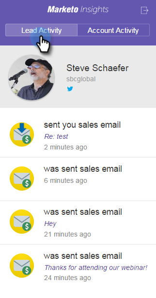

# Affichage des informations et des activités de personne et de compte dans Google Mail {#view-person-and-account-information-and-activities-in-google-mail}

## Affichage des activités dans Google Mail {#view-activities-in-google-mail}

Utilisez le volet Informations sur Marketo contextuelles pour afficher les informations du compte et les activités récentes.

Le volet apparaît dans le volet de lecture Courrier Google normal pour les éléments Boîte de réception et Envoyé et affiche des informations et des activités pour la personne qui vous a envoyé l’email que vous avez lu (ou à qui vous avez envoyé l’email pour les éléments du dossier Envoyé).

L’onglet Activité de personne affiche des informations pertinentes sur la personne, telles que son nom, son titre, son image, etc. Vous pouvez également afficher les activités les plus récentes qui se sont produites après l’envoi d’un email, telles que la visite d’une page web, le remplissage d’un formulaire, le clic sur un lien, la participation à un événement et l’ouverture d’un email.

L’onglet Activité du compte affiche les informations de compte pertinentes, telles que le nom de la société, l’URL du site web et l’emplacement. L’onglet affiche également les activités de compte les plus récentes. Le compte est identifié par le domaine de la personne. Les activités apparaissent dans la liste si un utilisateur de Sales Insight de votre abonnement ne les a jamais correspondantes.

Si votre équipe n’a jamais échangé d’email de vente avec la personne, aucune activité ne s’affiche.

Cliquez sur l’icône pour réduire le volet.

Cliquez sur l’icône Marketo pour développer le volet.

## Affichage des activités dans Google Chrome {#view-activities-in-google-chrome}

Vous pouvez également utiliser le volet Activité globale de Google Chrome pour afficher la liste complète des activités les plus récentes qui se sont produites pour toutes les personnes avec lesquelles vous avez correspondu récemment. Il s’agit d’un flux mis à jour en temps réel qui affiche en permanence le nombre d’activités non lues sur l’icône.

Cliquez sur l’icône Marketo pour ouvrir le volet.

>[!MORELIKETHIS]
>
>[Utilisation de Marketo Insights pour Google Chrome](/help/marketo/product-docs/marketo-sales-insight/msi-chrome-plugin/using-marketo-insights-for-google-chrome.md)
