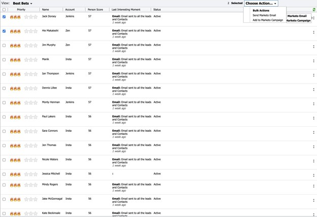

# [!DNL Best Bets] {#best-bets}

L’onglet [!UICONTROL &#x200B; Meilleurs résultats &#x200B;] comprend une liste de tous vos leads en fonction de leur priorité, calculée à l’aide de l’urgence et du score relatif.

En cliquant sur le menu en forme de point dans la colonne Actions, vous pouvez utiliser des options d’engagement telles que :

* [!UICONTROL Envoyer un e-mail Marketo]
* [!UICONTROL Ajouter à Marketo Campaign]

Vous pouvez également sélectionner plusieurs prospects dans l’onglet [!DNL Best Bets] et choisir _[!UICONTROL Envoyer un e-mail Marketo]_ ou _[!UICONTROL Ajouter à Marketo Campaign]_.

