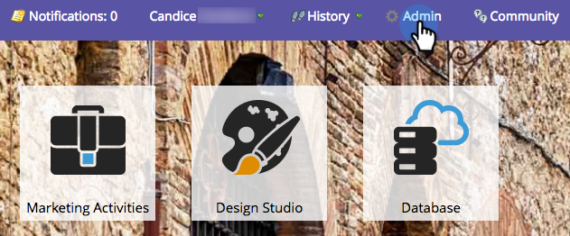

# Télécharger la solution [!DNL Marketo Sales Insight] pour [!DNL Microsoft Dynamics] {#download-the-marketo-sales-insight-solution-for-microsoft-dynamics}

>[!NOTE]
>
>**Autorisations d’administration requises**

>[!IMPORTANT]
>
>Le plug-in de cette page est destiné aux personnes qui se synchronisent avec Marketo Engage à l’aide de la solution de synchronisation CRM native Marketo pour [!DNL Dynamics 365]. Pour ceux qui disposent des éléments suivants : une synchronisation personnalisée, [!DNL MS Dynamics 365 Online] (9.x et versions ultérieures) et ont acheté des [!DNL Marketo Sales Insight], le package [ est disponible ici](https://mktg-cdn.marketo.com/community/MarketoSalesInsight_NonNative.zip){target="_blank"}.

1. Accédez à la zone **[!UICONTROL Admin]**.

   

1. Cliquez sur **CRM**.

   

1. Sélectionnez ****.

   

1. Sélectionnez **[!UICONTROL Télécharger la solution Marketo]**.

   

1. Sélectionnez la solution appropriée pour votre version de [!DNL Microsoft Dynamics].

   

Fantastique ! Un fichier zip de la solution sera téléchargé sur votre appareil.
