# Installation et configuration d’[!DNL Marketo Sales Insight] dans [!DNL Microsoft Dynamics 2011] {#install-and-configure-marketo-sales-insight-in-microsoft-dynamics}

[!DNL Marketo Sales Insight] est un outil fantastique pour votre équipe de vente. Vous trouverez ci-dessous les instructions étape par étape pour l’installer et le configurer dans [!DNL Microsoft Dynamics 2011] On-Premise.

>[!PREREQUISITES]
>
>Terminez votre intégration Marketo-Microsoft.
>
>[Téléchargez la solution appropriée](/help/marketo/product-docs/marketo-sales-insight/msi-for-microsoft-dynamics/installing/download-the-marketo-sales-insight-solution-for-microsoft-dynamics.md) pour votre version de [!DNL Microsoft Dynamics] CRM.

## Importer la solution {#import-solution}

1. Connectez-vous à [!DNL Microsoft Dynamics] CRM. Cliquez sur **[!UICONTROL Paramètres]** dans le menu inférieur gauche.

   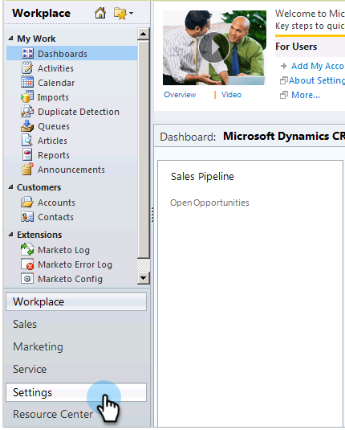

1. Sélectionnez **[!UICONTROL Solutions]** dans l’arborescence.

   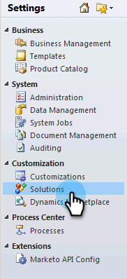

1. Cliquez sur **Importer** ( ).

   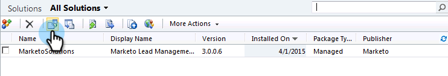

   >[!NOTE]
   >
   >Vous devez déjà avoir [installé et configuré](/help/marketo/product-docs/marketo-sales-insight/msi-for-microsoft-dynamics/installing/install-and-configure-marketo-sales-insight-in-microsoft-dynamics-2011.md) la solution Marketo avant de continuer.

1. Cliquez sur **[!UICONTROL Parcourir]**. Sélectionnez la solution [!DNL Marketo Sales Insight] que vous [téléchargé](/help/marketo/product-docs/marketo-sales-insight/msi-for-microsoft-dynamics/installing/download-the-marketo-sales-insight-solution-for-microsoft-dynamics.md). Cliquez sur **[!UICONTROL Suivant]**.

   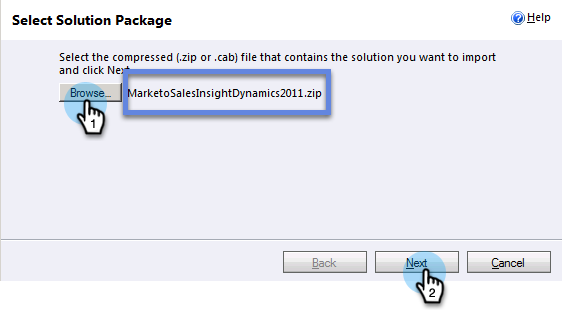

1. Vérifiez les détails de la solution, puis cliquez sur **[!UICONTROL Suivant]**.

   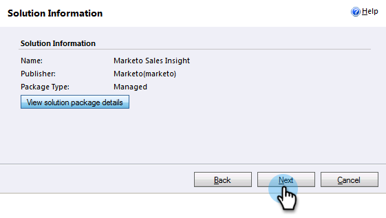

1. Assurez-vous que l’option Message SDK est cochée. Cliquez sur **[!UICONTROL Suivant]**.

   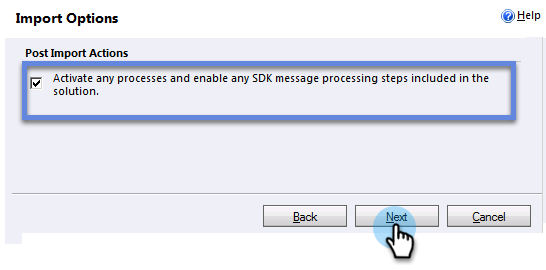

1. Attendez maintenant la fin de l’importation.

   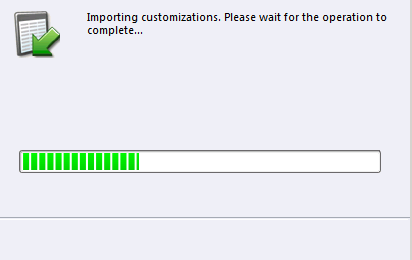

1. Cliquez sur **[!UICONTROL Fermer]**.

   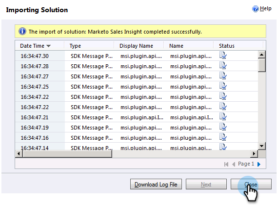

1. [!DNL Marketo Sales Insight] apparaît désormais dans la liste des solutions. Ouais !

   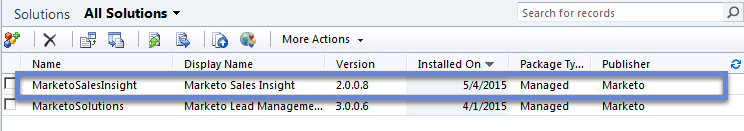

1. Sélectionnez [!DNL Marketo Sales Insight] et cliquez sur **Publier toutes les personnalisations** ( ).

   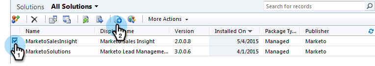

## Connecter Marketo et Sales Insight  {#connect-marketo-and-sales-insight}

>[!NOTE]
>
>**Autorisations d’administration requises**

1. Connectez-vous à Marketo et cliquez sur **[!UICONTROL Admin]**.

   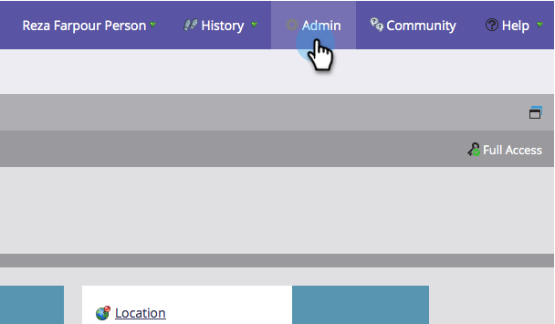

1. Dans la section Insight des ventes **, cliquez sur**&#x200B;[!UICONTROL &#x200B; Modifier la configuration de l’API &#x200B;]&#x200B;**.**

   

1. Copiez l’**[!UICONTROL hôte]**, l’**[!UICONTROL URL de l’API]** et l’**[!UICONTROL ID d’utilisateur de l’API]** à utiliser à une étape ultérieure. Saisissez une **[!UICONTROL Clé secrète API]** de votre choix, puis cliquez sur **[!UICONTROL Enregistrer]**.

   >[!CAUTION]
   >
   >N’utilisez pas d’esperluette (&amp;) dans votre clé secrète API.

   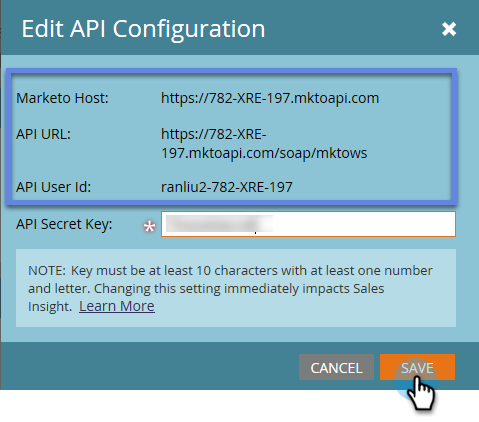

   >[!NOTE]
   >
   >Les champs suivants doivent être synchronisés avec Marketo pour _Lead et Contact_ pour que Sales Insight fonctionne :
   >
   >* Priorité
   >* Urgence
   >* Évaluation relative
   >
   >Si l’un de ces champs est manquant, un message d’erreur s’affiche dans Marketo avec le nom des champs manquants. Pour résoudre ce problème, procédez [comme suit](/help/marketo/product-docs/marketo-sales-insight/msi-for-microsoft-dynamics/setting-up-and-using/required-fields-for-syncing-marketo-with-dynamics.md).

1. Revenez à Dynamics, sélectionnez **[!UICONTROL Paramètres]**.

   

1. Sélectionnez **[!UICONTROL Configuration de l’API]** dans l’arborescence.

   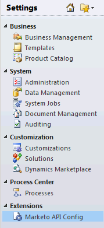

1. Cliquez sur **[!UICONTROL Configuration par défaut]**.

   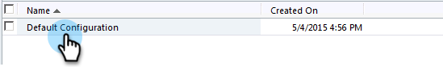

1. Saisissez les informations extraites de Marketo précédemment.

   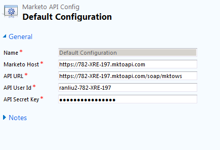

1. Cliquez sur **[!UICONTROL Enregistrer]**

   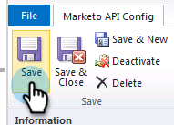

## Définir l’accès utilisateur {#set-user-access}

Configurez les rôles utilisateur pour permettre à des utilisateurs spécifiques d’accéder aux [!DNL Sales Insight].

1. Sélectionnez **[!UICONTROL Paramètres]**.

   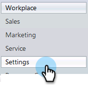

1. Sélectionnez **[!UICONTROL Administration]** dans l’arborescence.

   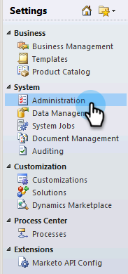

1. Cliquez sur **[!UICONTROL Utilisateurs]**.

   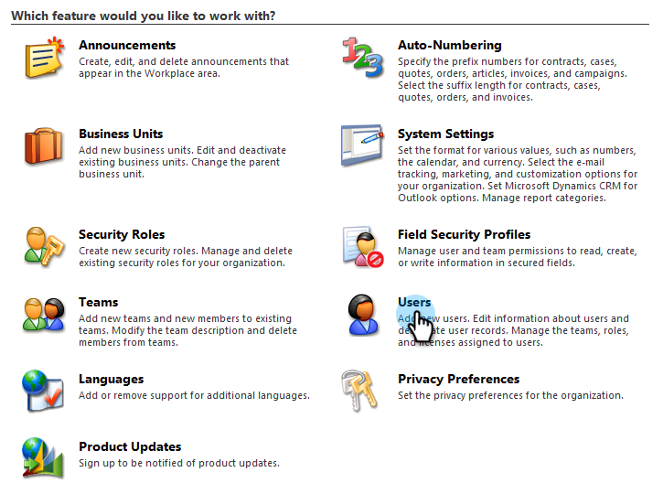

1. Sélectionnez le ou les utilisateurs auxquels vous souhaitez accorder l’accès et cliquez sur **[!UICONTROL Gérer les rôles]**.

   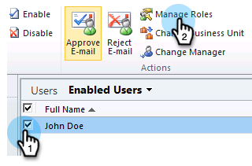

1. Sélectionnez le rôle **[!UICONTROL Marketo Sales Insight]** et cliquez sur **[!UICONTROL OK]**.

   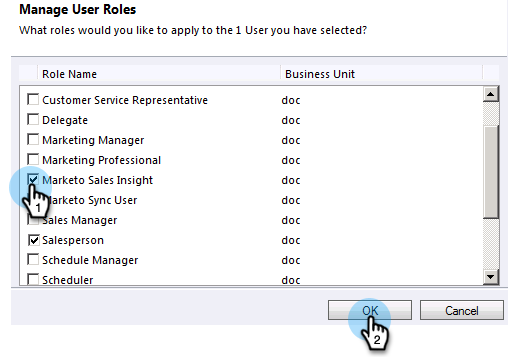

   Tous les utilisateurs autorisés d’accès pourront désormais voir la section insight des ventes dans la vue des détails du prospect/contact.

   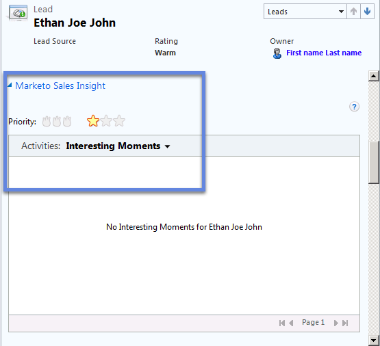

>[!MORELIKETHIS]
>
>[Configuration des étoiles et des flammes pour les enregistrements de leads/contacts](/help/marketo/product-docs/marketo-sales-insight/msi-for-microsoft-dynamics/setting-up-and-using/setting-up-stars-and-flames-for-lead-contact-records.md)
