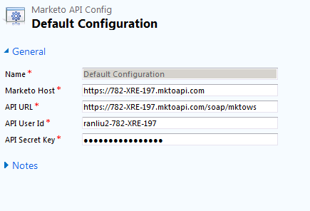

# Installation et configuration de Marketo Sales Insight dans Microsoft Dynamics 2011 {#install-and-configure-marketo-sales-insight-in-microsoft-dynamics}

Marketo Sales Insight est un outil fantastique pour votre équipe commerciale. Voici les instructions étape par étape de l’installation et de la configuration dans Microsoft Dynamics 2011 On-Premise.

>[!PREREQUISITES]
>
>Terminez votre intégration Marketo-Microsoft.
>
>[Télécharger la solution appropriée](/help/marketo/product-docs/marketo-sales-insight/msi-for-microsoft-dynamics/installing/download-the-marketo-sales-insight-solution-for-microsoft-dynamics.md) pour votre version de Microsoft Dynamics CRM.

## Importer la solution {#import-solution}

1. Connectez-vous à Microsoft Dynamics CRM. Cliquez sur **Paramètres** dans le menu inférieur gauche.

   

1. Sélectionner **Solutions** dans l&#39;arbre.

   

1. Cliquez sur **Importer** ( ).

   

   >[!NOTE]
   >
   >Vous devriez déjà avoir [installé et configuré](/help/marketo/product-docs/marketo-sales-insight/msi-for-microsoft-dynamics/installing/install-and-configure-marketo-sales-insight-in-microsoft-dynamics-2011.md) la solution Marketo avant de passer à l’étape suivante.

1. Cliquez sur **Parcourir**. Sélectionnez la solution Marketo Sales Insight [téléchargé](/help/marketo/product-docs/marketo-sales-insight/msi-for-microsoft-dynamics/installing/download-the-marketo-sales-insight-solution-for-microsoft-dynamics.md). Cliquez sur **Suivant**.

   

1. Vérifiez les détails de la solution, puis cliquez sur **Suivant**.

   

1. Assurez-vous que l’option Message du SDK est cochée. Cliquez sur **Suivant**.

   

1. Maintenant, attendez la fin de l’importation.

   

1. Cliquez sur **Fermer**.

   

1. Marketo Sales Insight apparaît désormais dans la liste des solutions. Oui !

   

1. Sélectionnez Marketo Sales Insight , puis cliquez sur **Publier toutes les personnalisations** ( ).

   

## Connexion de Marketo et de Sales Insight  {#connect-marketo-and-sales-insight}

>[!NOTE]
>
>**Autorisations d’administrateur requises**

1. Connectez-vous à Marketo et cliquez sur **Administration**.

   

1. Sous , **Statistiques des ventes** clic sur la section **Modifier la configuration de l’API**.

   

1. Copiez le **Hôte Marketo**, **URL de l’API**, et **Identifiant utilisateur de l’API** à utiliser ultérieurement. Saisissez un **Clé secrète API** de votre choix et cliquez sur **Enregistrer**.

   >[!CAUTION]
   >
   >N’utilisez pas d’esperluette (&amp;) dans votre clé secrète API.

   

   >[!NOTE]
   >
   >Les champs suivants doivent être synchronisés avec Marketo pour _prospect et contact_ pour que Sales Insight fonctionne :
   >
   >* Priorité
   >* Urgence
   >* Évaluation relative
   >
   >Si l’un de ces champs est manquant, un message d’erreur s’affiche dans Marketo avec le nom des champs manquants. Pour corriger ce problème, effectuez les opérations suivantes : [cette procédure](/help/marketo/product-docs/marketo-sales-insight/msi-for-microsoft-dynamics/setting-up-and-using/required-fields-for-syncing-marketo-with-dynamics.md).

1. Revenez à Dynamics, sélectionnez **Paramètres**.

   

1. Sélectionner **Configuration de l’API Marketo** dans l&#39;arbre.

   

1. Cliquez sur **Configuration par défaut**.

   

1. Saisissez les informations que vous avez précédemment saisies dans Marketo.

   

1. Cliquez sur **Enregistrer**.

   

## Définition de l’accès utilisateur {#set-user-access}

Configurez les rôles utilisateur pour donner aux utilisateurs spécifiques un accès à Sales Insight.

1. Sélectionner **Paramètres**.

   

1. Sélectionner **Administration** dans l&#39;arbre.

   

1. Cliquez sur **Utilisateurs**.

   

1. Sélectionnez le ou les utilisateurs auxquels vous souhaitez accorder l’accès, puis cliquez sur **Gestion des rôles**.

   

1. Sélectionnez la **Marketo Sales Insight** rôle et clic **OK**.

   

   Et voilà ! Tous les utilisateurs ayant accès à pourront désormais afficher la section des statistiques sur les ventes dans la vue des détails de prospect/contact.

   

   Félicitations. Vous avez désormais libéré la puissance de Marketo Sales Insight.

>[!MORELIKETHIS]
>
>[Configuration des étoiles et des flammes pour les enregistrements de piste/contact](/help/marketo/product-docs/marketo-sales-insight/msi-for-microsoft-dynamics/setting-up-and-using/setting-up-stars-and-flames-for-lead-contact-records.md)
