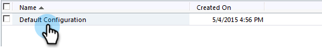

# Installation et configuration de Marketo Sales Insight dans Microsoft Dynamics 2011 {#install-and-configure-marketo-sales-insight-in-microsoft-dynamics}

Marketing Sales Insight est un outil fantastique pour votre équipe commerciale. Voici les instructions détaillées d&#39;installation et de configuration dans Microsoft Dynamics 2011 On-Premises.

>[!NOTE]
>
>**Conditions préalables**
>
>Effectuez votre intégration Marketo-Microsoft.
>
>[Téléchargez la solution](http://docs.marketo.com/x/LoJo) appropriée pour votre version de Microsoft Dynamics CRM.

## Importer la solution {#import-solution}

1. Connectez-vous à Microsoft Dynamics CRM. Cliquez sur **Paramètres** dans le menu inférieur gauche.

   

1. Sélectionnez **Solutions** dans l’arborescence.

   

1. Cliquez sur **Importer** ( ).

   

   >[!NOTE]
   >
   >**Rappel**
   >
   >
   >Vous devez déjà avoir [installé et configuré](install-and-configure-marketo-sales-insight-in-microsoft-dynamics-2011.md) la solution Marketo avant de passer à l’étape suivante.

1. Cliquez sur **Parcourir**. Sélectionnez la solution Marketing Cloud Sales Insight que vous avez [téléchargée](download-the-marketo-sales-insight-solution-for-microsoft-dynamics.md). Cliquez sur **Suivant**.

   

1. Vérifiez les détails de la solution, puis cliquez sur **Suivant**.

   

1. Assurez-vous que l’option de message SDK est cochée. Cliquez sur **Suivant**.

   

1. Attendez maintenant la fin de l’importation.

   

1. Cliquez sur **Fermer**.

   

1. Les statistiques commerciales de Marketing Cloud s’affichent désormais dans la liste de solutions. Ouais !

   

1. Sélectionnez Marketing to Sales Insight, puis cliquez sur **Publier toutes les personnalisations** ( ).

   

## Connexion à Marketing et à Sales Insight  {#connect-marketo-and-sales-insight}

>[!NOTE]
>
>**Autorisations d’administrateur requises**

1. Connectez-vous à Marketing et cliquez sur **Admin**.

   

1. Sous la section **Sales Insight **cliquez sur **Modifier la configuration** de l&#39;API.

   

1. Copiez l’hôte **** marketing, l’URL **** API et l’ID **d’utilisateur** API pour l’utiliser ultérieurement. Saisissez une clé **secrète** API de votre choix et cliquez sur **ENREGISTRER**.

   >[!CAUTION]
   >
   >N’utilisez pas d’esperluette (&amp;) dans votre clé secrète API.

   

   >[!NOTE]
   >
   >Les champs suivants doivent être synchronisés avec Marketo pour que le prospect et le contact *pour que Sales Insight fonctionnent* à la fois :
   >
   >    
   >    
   >    * Priorité
   >    * Urgence
   >    * Note relative

   >    
   >    
   >Si l’un de ces champs est manquant, un message d’erreur s’affiche dans Marketo avec le nom des champs manquants. Pour corriger ce problème, effectuez [cette procédure](../../../../product-docs/marketo-sales-insight/msi-for-microsoft-dynamics/setting-up-and-using/required-fields-for-syncing-marketo-with-dynamics.md).

1. Revenez à Dynamics, sélectionnez **Settings**(Paramètres).

   

1. Sélectionnez Configuration **de l’API** Marketo dans l’arborescence.

   

1. Cliquez sur Configuration **** par défaut.

   

1. Entrez les informations que vous avez reçues de Marketo plus tôt.

   

1. Cliquez sur **Enregistrer.**

   ** 

   **

## Définir l&#39;accès utilisateur {#set-user-access}

Configurez des rôles d&#39;utilisateur pour permettre à des utilisateurs spécifiques d&#39;accéder à Sales Insight.

1. Sélectionnez **Paramètres**.

   

1. Sélectionnez **Administration** dans l’arborescence.

   

1. Cliquez sur **Utilisateurs**.

   

1. Sélectionnez le ou les utilisateurs auxquels vous souhaitez accorder l’accès et cliquez sur **Gérer les rôles**.

   

1. Sélectionnez le rôle **Marketo Sales Insight** et cliquez sur **OK**.

   

   Et c&#39;est tout ! Tous les utilisateurs ont accès à la section commerciale de la vue des détails de prospect/contact.

   

   Félicitations. Vous avez maintenant libéré la puissance de Marketo Sales Insight.

>[!NOTE]
>
>**Articles connexes**
>
>[Configuration des étoiles et des flammes pour les enregistrements de piste/contact](http://docs.marketo.com/x/BICMAg)

