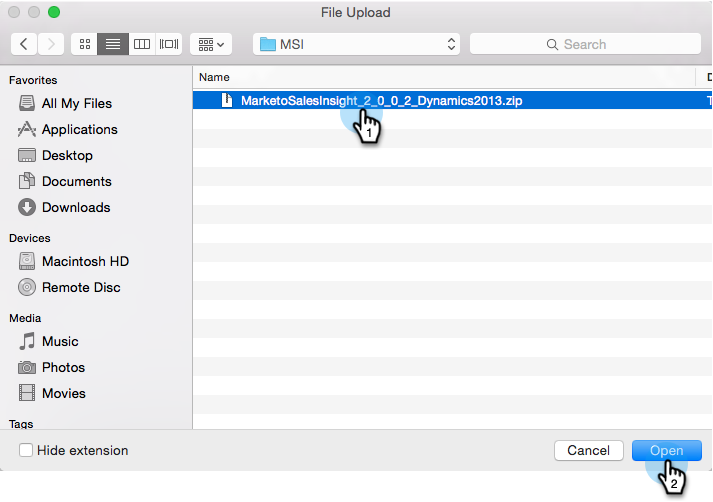
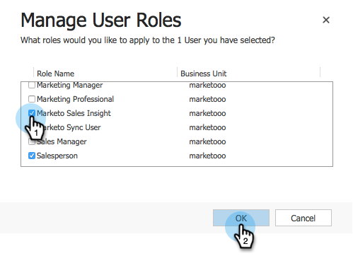

# Installer et configurer Marketo Sales Insight dans Microsoft Dynamics 2013 {#install-and-configure-marketo-sales-insight-in-microsoft-dynamics}

Marketing Sales Insight est un outil fantastique pour donner à votre équipe commerciale une &quot;fenêtre&quot; sur la richesse des données dont dispose l&#39;équipe marketing. Voici comment l&#39;installer et le configurer.

>[!PREREQUISITES]
>
>Effectuez votre [intégration Marketo-Microsoft](http://docs.marketo.com/x/EIA2).
>
>[Téléchargez la bonne ](http://docs.marketo.com/x/LoJo) solution pour votre version de Microsoft Dynamics CRM.

## Importer la solution {#import-solution}

OK, maintenant il est temps d&#39;importer la solution Marketing Sales Insight dans Microsoft Dynamics.

1. Sous **Microsoft Dynamics CRM**, cliquez sur **Paramètres**.

   

1. Sous **Paramètres**, cliquez sur **Personnalisations**.

   

1. Cliquez sur **Solutions**.

   

   >[!NOTE]
   >
   >**Rappel**
   >
   >
   >Vous devez déjà avoir installé et configuré Marketo avant de poursuivre.

1. Cliquez sur **Importer**.

   

1. Dans la nouvelle fenêtre, cliquez sur **Parcourir**.

   

1. Recherchez et sélectionnez la solution que vous avez téléchargée ci-dessus.

   

1. Cliquez sur **Suivant**.

   

1. La solution sera chargée. Vous pouvez vue le contenu du package si vous le souhaitez. Cliquez sur **Suivant**.

   

1. Veillez à laisser la case cochée et à cliquer sur **Importer**.

   

1. N’hésitez pas à télécharger le fichier journal. Cliquez sur **Fermer**.

   

1. Super ! Vous devriez voir la solution maintenant. S&#39;il n&#39;y est pas, actualisez votre écran.

   

## Connecter Marketing et Sales Insight {#connect-marketo-and-sales-insight}

Lions votre instance Marketo à Sales Insight in Dynamics.

>[!NOTE]
>
>Droits d’administration requis.

1. Connectez-vous à Marketing et accédez à la section **Admin**.

   

1. Sous la section **Sales Insight**, cliquez sur **Modifier la configuration de l&#39;API**.

   

1. Copiez l’**hôte marketing**, l’**URL de l’API** et l’**ID utilisateur de l’API** pour l’utiliser ultérieurement. Saisissez une **clé secrète API** de votre choix et cliquez sur **SAVE**.

   >[!CAUTION]
   >
   >N’utilisez pas d’esperluette (&amp;) dans votre clé secrète API.

   

   >[!NOTE]
   >
   >Pour que Sales Insight fonctionne, les champs suivants doivent être synchronisés avec Marketo pour *à la fois prospect et contact* :
   >
   >    
   >    
   >    * Priorité
   >    * Urgence
   >    * Note relative

   >    
   >    
   >Si l’un de ces champs est manquant, un message d’erreur s’affiche dans Marketo avec le nom des champs manquants. Pour corriger ce problème, effectuez [cette procédure](../../../../product-docs/marketo-sales-insight/msi-for-microsoft-dynamics/setting-up-and-using/required-fields-for-syncing-marketo-with-dynamics.md).

1. De retour dans Microsoft Dynamics, accédez à **Paramètres**.

   

1. Sous **Paramètres**, cliquez sur **Configuration de l’API de marketing**.

   

1. Cliquez sur **Nouveau**.

   

1. Saisissez les informations que vous avez précédemment prises de Marketo et cliquez sur **Enregistrer**.

   

## Définir l&#39;accès utilisateur {#set-user-access}

Enfin, vous pouvez donner aux utilisateurs spécifiques l’accès à Marketing Cloud Sales Insight.

1. Accédez à **Paramètres**.

   

1. Cliquez sur **Utilisateurs**.

   

1. Sélectionnez le ou les utilisateurs auxquels vous souhaitez donner accès à Sales Insight et cliquez sur **Gérer les rôles**.

   

1. Sélectionnez le rôle **Analyse commerciale** et cliquez sur **OK**.

   

   Et vous devriez avoir terminé ! Enfin, pour tester, connectez-vous à Dynamics en tant qu&#39;utilisateur qui a accès à Marketo Sales Insight et consultez un prospect ou un contact.

   

Vous avez déverrouillé la puissance de Marketing Cloud Sales Insight pour votre équipe commerciale.

>[!MORELIKETHIS]
>
>[Configuration des étoiles et des flammes pour les enregistrements de piste/contact](http://docs.marketo.com/x/BICMAg)

