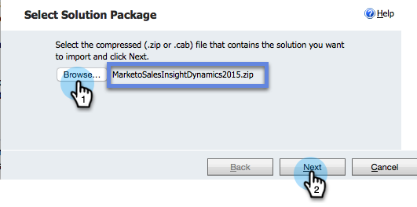

# Installation et configuration de Marketo Sales Insight dans Microsoft Dynamics 365 {#install-and-configure-marketo-sales-insight-in-microsoft-dynamics}

Marketing Sales Insight est un outil fantastique qui permet à votre équipe commerciale de découvrir la richesse des données dont dispose l’équipe marketing. Voici comment installer et configurer.

>[!PREREQUISITES]
>
>Effectuez votre intégration Marketo-Microsoft.
>
>[Téléchargez la solution](http://docs.marketo.com/x/LoJo) appropriée pour votre version de Microsoft Dynamics CRM.

## Importer la solution {#import-solution}

1. Connectez-vous à [Microsoft Office 365](https://login.microsoftonline.com/).

   

1. Cliquez sur le  menu et sélectionnez **CRM**.

   

1. Cliquez sur le  menu. Dans la liste déroulante, sélectionnez **Paramètres**, puis **Solutions**.

   

   >[!NOTE]
   >
   >**Rappel**
   >
   >
   >Vous devez déjà avoir [installé et configuré la solution](../../../../product-docs/crm-sync/microsoft-dynamics-sync/sync-setup/microsoft-dynamics-365/step-1-of-3-install.md) Marketo avant de poursuivre.

   Cliquez sur Importer.
   

1. Dans la nouvelle fenêtre, cliquez sur **Parcourir**. Sélectionnez la solution [Marketo Sales Insight que vous avez téléchargée à l’étape 1](#msi). Cliquez sur **Suivant**.

   

1. La solution sera chargée. Vous pouvez vue le contenu du package si vous le souhaitez. Cliquez sur **Suivant**.

   

1. Veillez à laisser la case **cochée** , puis cliquez sur **Importer**.

   

1. N’hésitez pas à télécharger le fichier journal. Cliquez sur **Fermer**.

   

1. Super ! Vous devriez voir la solution maintenant. S&#39;il n&#39;y est pas, actualisez votre écran.

   

1. Cliquez sur **Publier toutes les personnalisations**.

   

## Connexion à Marketing et à Sales Insight {#connect-marketo-and-sales-insight}

Lions votre instance Marketo à Sales Insight in Dynamics. Voici comment procéder :

>[!NOTE]
>
>**Autorisations d’administrateur requises**

1. Connectez-vous à Marketing et accédez à la section **Admin** .

   

1. Sous la section **Sales Insight** , cliquez sur **Modifier la configuration** de l&#39;API.

   

1. Copiez l’hôte **** marketing, l’URL **** API et l’ID **d’utilisateur** API pour l’utiliser ultérieurement. Saisissez une clé **secrète** API de votre choix et cliquez sur **ENREGISTRER**.

   >[!CAUTION]
   >
   >N’utilisez pas d’esperluette (&amp;) dans votre clé secrète API.

   

   >[!NOTE]
   >
   >Les champs suivants doivent être synchronisés avec Marketo pour que le prospect et le contact *pour que Sales Insight fonctionnent* à la fois :
   >
   > * Priorité
   > * Urgence
   > * Note relative

   >
   >Si l’un de ces champs est manquant, un message d’erreur s’affiche dans Marketo avec le nom des champs manquants. Pour corriger ce problème, effectuez [cette procédure](../../../../product-docs/marketo-sales-insight/msi-for-microsoft-dynamics/setting-up-and-using/required-fields-for-syncing-marketo-with-dynamics.md).

1. De retour dans Microsoft Dynamics, cliquez sur l&#39;  icône en regard de Paramètres, puis sélectionnez Configuration **de l&#39;API** Marketo dans la liste déroulante.

   

1. Cliquez sur Configuration **** par défaut.

   

1. Saisissez les informations que vous avez copiées précédemment à partir de Marketo.

   

1. Cliquez sur l’  icône située dans le coin inférieur droit pour enregistrer les modifications.

## Définir l&#39;accès utilisateur {#set-user-access}

Vous devez accorder aux utilisateurs les autorisations nécessaires pour utiliser Sales Insight.

1. Cliquez sur le  menu. Dans le menu déroulant, sélectionnez **Paramètres**, puis sélectionnez **Sécurité**.

   

1. Cliquez sur **Utilisateurs**.

   

1. Sélectionnez le ou les utilisateurs auxquels vous souhaitez donner accès à Sales Insight, puis cliquez sur **Gérer les rôles**.

   

1. Sélectionnez le rôle **Marketo Sales Insight** et cliquez sur **OK**.

   

   Et vous devriez avoir terminé ! Enfin, pour tester, connectez-vous à Dynamics en tant qu&#39;utilisateur qui a accès à Marketo Sales Insight et regardez un prospect ou un contact.

   

Vous avez déverrouillé la puissance de Marketing Cloud Sales Insight pour votre équipe commerciale.

>[!NOTE]
>
>**Articles connexes**
>
>[Configuration des étoiles et des flammes pour les enregistrements de piste/contact](http://docs.marketo.com/x/BICMAg)