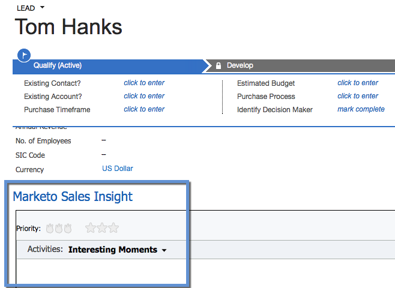

# Installation et configuration d’[!DNL Marketo Sales Insight] dans [!DNL Microsoft Dynamics 365] {#install-and-configure-marketo-sales-insight-in-microsoft-dynamics}

[!DNL Marketo Sales Insight] est un outil fantastique pour donner à votre équipe de vente une « fenêtre » sur la richesse des données dont dispose l’équipe marketing. Voici comment installer et configurer.

>[!PREREQUISITES]
>
>Terminez votre intégration Marketo-Microsoft.
>
>[Téléchargez la solution appropriée](/help/marketo/product-docs/marketo-sales-insight/msi-for-microsoft-dynamics/installing/download-the-marketo-sales-insight-solution-for-microsoft-dynamics.md) pour votre version d’[!DNL Microsoft Dynamics CRM].

## Importer la solution {#import-solution}

1. Connectez-vous à [[!DNL Microsoft Office 365]](https://login.microsoftonline.com/).

   

1. Cliquez sur le menu  et sélectionnez **CRM**.

   

1. Cliquez sur le menu . Dans la liste déroulante, sélectionnez **[!DNL Settings]**, puis **[!DNL Solutions]**.

   

   >[!NOTE]
   >
   >Vous devez déjà avoir [installé et configuré la solution Marketo](/help/marketo/product-docs/crm-sync/microsoft-dynamics-sync/sync-setup/microsoft-dynamics-365-with-ropc-connection/step-1-of-4-install.md) avant de continuer.

1. Cliquez sur **[!UICONTROL Importer]**.

   

1. Dans la nouvelle fenêtre, cliquez sur **[!UICONTROL Parcourir]**. Choisissez la solution Marketo Sales Insight [que vous avez téléchargée à l’étape 1](#msi). Cliquez sur **[!UICONTROL Suivant]**.

   

1. La solution sera chargée. Vous pouvez afficher le contenu du package si vous le souhaitez. Cliquez sur **[!UICONTROL Suivant]**.

   

1. Veillez à laisser la case **[!UICONTROL cochée]** et à cliquer sur **[!UICONTROL Importer]**.

   

1. N’hésitez pas à télécharger le fichier journal. Cliquez sur **[!UICONTROL Fermer]**.

   

1. Génial ! Vous devriez voir la solution maintenant. S&#39;il n&#39;y en a pas, rafraîchissez votre écran.

   

1. Cliquez sur **[!UICONTROL Publier toutes les personnalisations]**.

   

## Connecter Marketo et [!DNL Sales Insight] {#connect-marketo-and-sales-insight}

Lions votre instance Marketo à [!DNL Sales Insight] dans [!DNL Dynamics]. Voici comment procéder :

>[!NOTE]
>
>**Autorisations d’administrateur requises**

1. Connectez-vous à Marketo et accédez à la section **[!UICONTROL Admin]**.

   

1. Dans la section **[!UICONTROL Insight des ventes]**, cliquez sur **Modifier la configuration de l’API**.

   

1. Copiez l’**[!UICONTROL hôte Marketo]**, l’**[!UICONTROL URL de l’API]** et l’**[!UICONTROL ID d’utilisateur de l’API]** à utiliser à une étape ultérieure. Saisissez une **[!UICONTROL Clé secrète API]** de votre choix, puis cliquez sur **[!UICONTROL Enregistrer]**.

   >[!CAUTION]
   >
   >N’utilisez pas d’esperluette (&amp;) dans votre clé secrète API.

   

   >[!NOTE]
   >
   >Les champs suivants doivent être synchronisés avec Marketo pour _Lead et Contact_ pour que [!DNL Sales Insight] fonctionne :
   >
   > * Priorité
   > * Urgence
   > * Évaluation relative
   >
   >Si l’un de ces champs est manquant, un message d’erreur s’affiche dans Marketo avec le nom des champs manquants. Pour résoudre ce problème, procédez [comme suit](/help/marketo/product-docs/marketo-sales-insight/msi-for-microsoft-dynamics/setting-up-and-using/required-fields-for-syncing-marketo-with-dynamics.md).

1. De retour dans [!DNL Microsoft Dynamics], cliquez sur l’icône  en regard de [!UICONTROL Paramètres], puis sélectionnez **[!UICONTROL Configuration de l’API Marketo]** dans la liste déroulante.

   

1. Cliquez sur **[!UICONTROL Configuration par défaut]**.

   

1. Saisissez les informations que vous avez copiées à partir de Marketo précédemment.

   

1. Cliquez sur l’icône  dans le coin inférieur droit pour enregistrer les modifications.

## Définir l’accès utilisateur {#set-user-access}

Vous devez autoriser les utilisateurs à utiliser [!DNL Sales Insight].

1. Cliquez sur le menu . Dans le menu déroulant, sélectionnez **[!UICONTROL Paramètres]**, puis **[!UICONTROL Sécurité]**.

   

1. Cliquez sur **[!UICONTROL Utilisateurs]**.

   

1. [!DNL Sales Insight] Sélectionnez le ou les utilisateurs auxquels vous souhaitez accorder l’accès et cliquez **[!UICONTROL Gérer les rôles]**.

   

1. Sélectionnez le rôle **[!UICONTROL Marketo Sales Insight]** et cliquez sur **[!UICONTROL OK]**.

   

   Et vous devriez en avoir fini ! Enfin, pour effectuer un test, connectez-vous à [!DNL Dynamics] en tant qu’utilisateur ayant accès à [!DNL Marketo Sales Insight] et recherchez un prospect ou un contact.

   

Vous avez maintenant libéré la puissance de [!DNL Marketo Sales Insight] pour votre équipe de vente.

>[!MORELIKETHIS]
>
>[Configuration des étoiles et des flammes pour les enregistrements de leads/contacts](/help/marketo/product-docs/marketo-sales-insight/msi-for-microsoft-dynamics/setting-up-and-using/setting-up-stars-and-flames-for-lead-contact-records.md)
