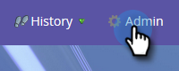

# Installation et configuration d’[!DNL Marketo Sales Insight] dans [!DNL Microsoft Dynamics Online] {#install-and-configure-marketo-sales-insight-in-microsoft-dynamics-online}

[!DNL Marketo Sales Insight] est un outil fantastique pour donner à votre équipe de vente une « fenêtre » sur la richesse des données dont dispose l’équipe marketing. Voici comment l&#39;installer et le configurer dans [!DNL Microsoft Dynamics Online].

>[!PREREQUISITES]
>
>Terminez votre intégration Marketo-Microsoft.
>
>[Téléchargez la solution appropriée](/help/marketo/product-docs/marketo-sales-insight/msi-for-microsoft-dynamics/installing/download-the-marketo-sales-insight-solution-for-microsoft-dynamics.md) pour votre version d’[!DNL Microsoft Dynamics CRM].

## Importer la solution {#import-solution}

>[!NOTE]
>
>Si vous utilisez l’interface unifiée, avant l’étape 1 ci-dessous, cliquez sur l’icône Paramètres dans le coin supérieur droit et sélectionnez **[!UICONTROL Paramètres avancés]**.

1. Sous Microsoft Dynamics CRM, cliquez sur **[!UICONTROL Paramètres]**.

   

1. Sous Paramètres, cliquez sur **[!UICONTROL Personnalisations]**.

   

1. Cliquez sur **[!UICONTROL Solutions]**.

   

   >[!NOTE]
   >
   >Vous devez avoir installé et configuré la solution Marketo avant de continuer.

1. Cliquez sur **[!UICONTROL Importer]**.

   

1. Dans la nouvelle fenêtre, cliquez sur **[!UICONTROL Parcourir]**.

   

1. Sur votre ordinateur, recherchez et installez la solution que vous venez de télécharger.

1. Cliquez sur **[!UICONTROL Suivant]**.

   

1. La solution sera chargée. Vous pouvez afficher le contenu du package si vous le souhaitez. Cliquez sur **[!UICONTROL Suivant]**.

   

1. Veillez à laisser la case cochée et à cliquer sur **[!UICONTROL Importer]**.

   

1. N’hésitez pas à télécharger le fichier journal, puis à cliquer sur **[!UICONTROL Fermer]**.

   

1. Génial ! Vous devriez voir la solution maintenant. S&#39;il n&#39;y en a pas, rafraîchissez votre écran.

   

1. Cliquez sur **[!UICONTROL Publier la personnalisation]**.

   >[!NOTE]
   >
   >Veillez à activer la synchronisation globale des [!DNL MS Dynamics].

## Connecter Marketo et [!DNL Sales Insight] {#connect-marketo-and-sales-insight}

Lions votre instance Marketo à [!DNL Sales Insight] dans [!DNL Dynamics]. Procédez comme suit :

>[!NOTE]
>
>**Autorisations d’administrateur requises**

1. Connectez-vous à Marketo et accédez à la section **[!UICONTROL Admin]**.

   

1. Dans la section [!UICONTROL Insight des ventes], cliquez sur **[!UICONTROL Modifier la configuration de l’API]**.

   

1. Copiez l’**[!UICONTROL hôte Marketo]**, l’**[!UICONTROL URL de l’API]** et l’**[!UICONTROL ID d’utilisateur de l’API]** à utiliser à une étape ultérieure. Saisissez la clé secrète API de votre choix, puis cliquez sur **[!UICONTROL Enregistrer]**.

   >[!CAUTION]
   >
   >N’utilisez pas d’esperluette (&amp;) dans votre clé secrète API.

   

   >[!NOTE]
   >
   >Les champs suivants doivent être synchronisés avec Marketo pour _Lead et Contact_ pour que [!DNL Sales Insight] fonctionne :
   >
   >* Priorité
   >* Urgence
   >* Évaluation relative
   >
   >Si l’un de ces champs est manquant, un message d’erreur s’affiche dans Marketo avec le nom des champs manquants. Pour résoudre ce problème, procédez [comme suit](/help/marketo/product-docs/marketo-sales-insight/msi-for-microsoft-dynamics/setting-up-and-using/required-fields-for-syncing-marketo-with-dynamics.md).

1. De retour dans [!DNL Microsoft Dynamics], accédez à **[!UICONTROL Paramètres]**.

   

1. Sous **[!UICONTROL Paramètres]**, cliquez sur **[!UICONTROL Configuration API Marketo]**.

   

1. Cliquez sur **[!UICONTROL Nouveau]**.

   

1. Saisissez les informations extraites de Marketo précédemment et cliquez sur **[!UICONTROL Enregistrer]**.

   

## Activer la synchronisation {#enable-sync}

1. Dans Marketo, cliquez sur **[!UICONTROL Admin]**.

   

1. Sous Intégration, sélectionnez **[!UICONTROL Microsoft Dynamics]**.

   

1. Cliquez sur **[!UICONTROL Activer la synchronisation]**.

   

1. Cliquez sur **[!UICONTROL Modifier]** en regard de [!UICONTROL Détails de synchronisation des champs].

   

1. Cela _automatiquement_ sélectionner les champs MSI précédemment désactivés ([!UICONTROL Urgence], [!UICONTROL Score relatif] et [!UICONTROL Priorité]). Il vous suffit de cliquer sur **[!UICONTROL Enregistrer]** pour commencer à synchroniser les données.

   

## Définir l’accès utilisateur {#set-user-access}

Enfin, vous devez donner à des utilisateurs spécifiques l’accès pour utiliser [!DNL Marketo Sales Insight].

1. Accédez à **[!UICONTROL Paramètres]**.

   

1. Accédez à **[!UICONTROL Sécurité]**.

   

1. Cliquez sur **[!UICONTROL Utilisateurs]**.

   

1. Sélectionnez les utilisateurs auxquels vous souhaitez accorder l’accès [!DNL Sales Insight] et cliquez sur **[!UICONTROL Gérer les rôles]**.

   

1. Sélectionnez le rôle [!DNL Marketo Sales Insight] et cliquez sur **[!UICONTROL OK]**.

   

   Et vous devriez en avoir fini ! Enfin, pour effectuer un test, connectez-vous à [!DNL Dynamics] en tant qu’utilisateur ayant accès à [!DNL Marketo Sales Insight] et recherchez un prospect ou un contact.

   

>[!MORELIKETHIS]
>
>[Configuration des étoiles et des flammes pour les enregistrements de leads/contacts](/help/marketo/product-docs/marketo-sales-insight/msi-for-microsoft-dynamics/setting-up-and-using/setting-up-stars-and-flames-for-lead-contact-records.md)
