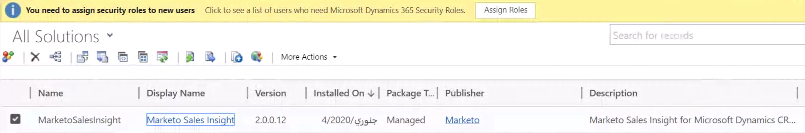

# Installer et configurer Marketo Sales Insight dans Microsoft Dynamics Online {#install-and-configure-marketo-sales-insight-in-microsoft-dynamics-online}

Marketing Sales Insight est un outil fantastique qui permet à votre équipe commerciale de découvrir la richesse des données dont dispose l’équipe marketing. Voici comment l&#39;installer et le configurer dans Microsoft Dynamics Online.

>[!PREREQUISITES]
>
>Effectuez votre intégration Marketo-Microsoft.
>
>[Téléchargez la solution](http://docs.marketo.com/x/LoJo) appropriée pour votre version de Microsoft Dynamics CRM.

## Importer la solution {#import-solution}

>[!NOTE]
>
>Si vous utilisez l’interface unifiée, avant l’étape 1 ci-dessous, cliquez sur l’icône Paramètres dans le coin supérieur droit et sélectionnez Paramètres **** avancés.

1. Sous Microsoft Dynamics CRM, cliquez sur **Paramètres**.

   

1. Sous PARAMÈTRES, cliquez sur **Personnalisations**.

   

1. Cliquez sur **Solutions**.

   

   >[!NOTE]
   >
   >**Rappel**
   >
   >
   >Vous devez déjà avoir installé et configuré la solution Marketo avant de poursuivre.

1. Cliquez sur **Importer**.

   

1. Dans la nouvelle fenêtre, cliquez sur **Parcourir**.

   

1. Sur votre ordinateur, recherchez et installez la solution que vous venez de télécharger.
1. Cliquez sur **Suivant**.

   

1. La solution sera chargée. Vous pouvez vue le contenu du package si vous le souhaitez. Cliquez sur **Suivant**.

   

1. Assurez-vous de laisser la case cochée et cliquez sur **Importer**.

   

1. N’hésitez pas à télécharger le fichier journal, puis cliquez sur **Fermer**.

   

1. Super ! Vous devriez voir la solution maintenant. S&#39;il n&#39;y est pas, actualisez votre écran.

   

1. Cliquez sur **Publier la personnalisation**.

   >[!NOTE]
   >
   >Veillez à activer la synchronisation MS Dynamics globale.

## Connexion à Marketing et à Sales Insight {#connect-marketo-and-sales-insight}

Lions votre instance Marketo à Sales Insight in Dynamics. Voici comment :

>[!NOTE]
>
>**Autorisations d’administrateur requises**

1. Connectez-vous au marketing et accédez à la **section Admin **section.

   

1. Sous la section Sales Insight, cliquez sur **Modifier la configuration** de l&#39;API.

   

1. Copiez l’hôte **** marketing, l’URL **** API et l’ID **d’utilisateur** API pour l’utiliser ultérieurement. Saisissez une clé secrète API de votre choix et cliquez sur **Enregistrer**.

   >[!CAUTION]
   >
   >N’utilisez pas d’esperluette (&amp;) dans votre clé secrète API.

   

   >[!NOTE]
   >
   >Les champs suivants doivent être synchronisés avec Marketo pour que le prospect et le contact *pour que Sales Insight fonctionnent* à la fois :
   >
   >    
   >    
   >    * Priorité
   >    * Urgence
   >    * Note relative

   >    
   >    
   >Si l’un de ces champs est manquant, un message d’erreur s’affiche dans Marketo avec le nom des champs manquants. Pour corriger ce problème, effectuez [cette procédure](../../../../product-docs/marketo-sales-insight/msi-for-microsoft-dynamics/setting-up-and-using/required-fields-for-syncing-marketo-with-dynamics.md).

1. De retour dans Microsoft Dynamics, accédez à **Paramètres**.

   

1. Sous **Paramètres**, cliquez sur Configuration **de l’API** Marketo.

   

1. Cliquez sur **Nouveau**.

   

1. Saisissez les informations que vous avez reçues de Marketo plus tôt et cliquez sur **Enregistrer**.

   

## Activer la synchronisation {#enable-sync}

1. Dans Marketing, cliquez sur **Admin**.

   

1. Sous Intégration, sélectionnez **Microsoft Dynamics**.

   

1. Cliquez sur **Activer la synchronisation**.

   

1. Cliquez sur **Modifier** en regard de Détails de synchronisation des champs.

   

1. Cela permet de sélectionner *automatiquement* les champs MSI précédemment désactivés (Urgence, Score relatif et Priorité). Il vous suffit de cliquer sur **Enregistrer** pour début des données de synchronisation.

   

## Définir l&#39;accès utilisateur {#set-user-access}

Enfin, vous devez donner aux utilisateurs spécifiques l&#39;accès à l&#39;utilisation de Marketing Cloud Sales Insight.

1. Accédez à **Paramètres**.

   

1. Accédez à **Sécurité**.

   

1. Cliquez sur **Utilisateurs**.

   

1. Sélectionnez les utilisateurs auxquels vous souhaitez donner accès à Sales Insight, puis cliquez sur **Gérer les rôles**.

   

1. Sélectionnez le rôle Sales Insight du marketing et cliquez sur **OK**.

   

   Et vous devriez avoir terminé ! Enfin, pour tester, connectez-vous à Dynamics en tant qu&#39;utilisateur qui a accès à Marketo Sales Insight et regardez un prospect ou un contact.

   

>[!NOTE]
>
>**Articles connexes**
>
>[Configuration des étoiles et des flammes pour les enregistrements de piste/contact](http://docs.marketo.com/x/BICMAg)

