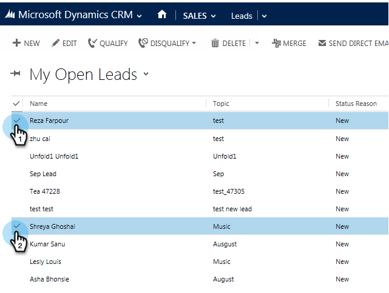

# Ajouter une piste/un contact à un Campaign marketing à partir de Microsoft Dynamics {#add-a-lead-contact-to-a-marketo-campaign-from-microsoft-dynamics}

Vous pouvez ajouter rapidement et facilement des pistes/contacts à des campagnes dynamiques Marketing Cloud directement depuis Microsoft Dynamics. Voici comment.

1. Dans Dynamics, accédez à la zone **Sales**.

   

1. Sélectionnez une vue.

   

1. Sélectionnez un ou plusieurs prospects ou contacts.

   

1. Cliquez sur** ...** et sélectionnez **Ajouter à Marketo Campaign**.

   

1. Sélectionnez la campagne marketing à laquelle vous souhaitez ajouter les pistes ou contacts, puis cliquez sur **Ajouter**.

   

   >[!NOTE]
   >
   >Pour que la campagne s’affiche dans la liste déroulante, utilisez le déclencheur [**Campaign is Requested**](http://docs.marketo.com/pages/viewpage.action?pageId=7514898), avec Sales Insight comme source, lorsque vous configurez la campagne.

Et c&#39;est tout le monde ! Vous disposez maintenant de la puissance des campagnes intelligentes de Marketo dans vos mains directement à partir de Dynamics.
