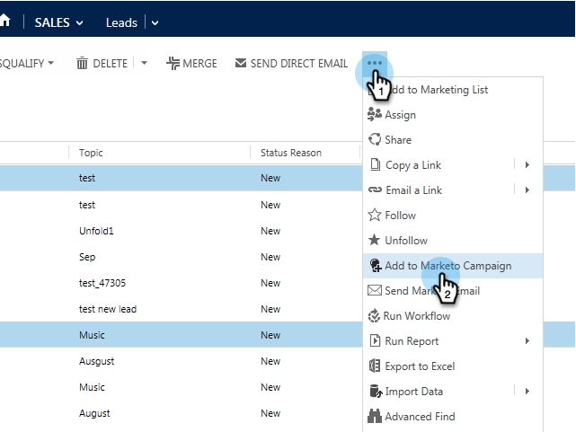

# Ajouter un lead/contact à une campagne Marketo à partir de l’adresse [!DNL Microsoft Dynamics] {#add-a-lead-contact-to-a-marketo-campaign-from-microsoft-dynamics}

Vous pouvez rapidement et facilement ajouter des prospects/contacts aux campagnes intelligentes Marketo directement depuis [!DNL Microsoft Dynamics]. Voici comment faire.

1. Dans [!DNL Dynamics], accédez à la zone **[!UICONTROL Ventes]**.

   

1. Sélectionnez une vue.

   

1. Sélectionnez un ou plusieurs prospects ou contacts.

   

1. Cliquez sur **...** et sélectionnez **[!UICONTROL Ajouter à Marketo Campaign]**.

   

1. Sélectionnez la campagne Marketo à laquelle vous souhaitez ajouter les prospects ou les contacts et cliquez sur **[!UICONTROL Ajouter]**.

   

   >[!NOTE]
   >
   >Pour que la campagne s’affiche dans la liste déroulante, utilisez le déclencheur [**La campagne est demandée** ](/help/marketo/product-docs/core-marketo-concepts/smart-campaigns/using-smart-campaigns/setting-up-a-trigger-smart-campaign-for-sales-using-campaign-is-requested.md) avec [!DNL Sales Insight] comme source, lorsque vous configurez la campagne.

Et c&#39;est tout le monde ! Vous disposez désormais de la puissance des campagnes intelligentes Marketo directement depuis [!DNL Dynamics].
