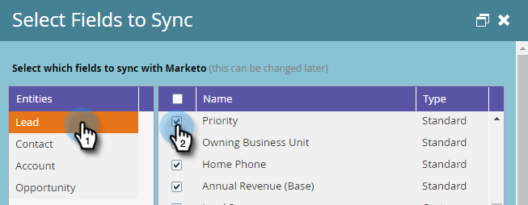
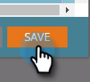

# Champs requis pour synchroniser le marketing avec Dynamics {#required-fields-for-syncing-marketo-with-dynamics}

Ces champs *doivent* être synchronisés avec Marketo pour que le prospect et le contact pour que Sales Insight fonctionnent :

* Priorité
* Urgence
* Note relative

Si l’un de ces champs est manquant, un message d’erreur s’affiche dans Marketo avec le nom des champs manquants. Pour corriger ce problème, archivez votre instance pour vous assurer que les champs sont synchronisés pour **Lead** et **Contact**. Sinon, ajoutez-les.

Voici comment vérifier et ajouter des champs de synchronisation.

1. Accédez à Admin et cliquez sur Microsoft Dynamics.

   

1. Cliquez sur Modifier dans Détails de synchronisation des champs.

   

1. Sous Piste, cochez la case Priorité.

   

1. Défilez maintenant et cochez la case Urgence...

   

1. ...et la case à cocher Note relative.

   

1. Cochez ensuite les cases Priorité, Urgence et Score relatif pour le contact.

   

1. Cliquez sur Enregistrer.

   

>[!NOTE]
>
>Veillez à patienter au moins 10 minutes pour qu’une synchronisation s’exécute avant de vérifier que vous avez corrigé le problème.

>[!MORELIKETHIS]
>
>[Configuration des étoiles et des flammes pour les enregistrements de piste/contact](http://docs.marketo.com/x/BICMAg)

