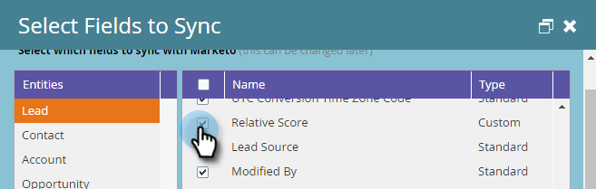

# Champs obligatoires pour la synchronisation de Marketo avec [!DNL Dynamics] {#required-fields-for-syncing-marketo-with-dynamics}

Ces champs *doivent* doivent être synchronisés avec Marketo pour [!UICONTROL Lead] et [!UICONTROL Contact] pour que [!DNL Sales Insight] fonctionne :

* Priorité
* Urgence
* Évaluation relative

Si l’un de ces champs est manquant, un message d’erreur s’affiche dans Marketo avec le nom des champs manquants. Pour résoudre ce problème, archivez votre instance afin de vous assurer que les champs sont synchronisés pour **[!UICONTROL Lead]** et **[!UICONTROL Contact]**. Sinon, ajoutez-les.

Voici comment vérifier et ajouter des champs de synchronisation.

1. Accédez à [!UICONTROL Admin] et cliquez sur **[!UICONTROL Microsoft Dynamics]**.

   

1. Cliquez sur **[!UICONTROL Modifier]** sur [!UICONTROL Détails de la synchronisation des champs].

   

1. Sous [!UICONTROL Lead], cochez la case [!UICONTROL Priorité].

   

1. Maintenant, faites défiler vers le bas et cochez la case [!UICONTROL Urgence]...

   

1. ...et la case [!UICONTROL Score relatif].

   

1. Ensuite, cochez les cases correspondant à [!UICONTROL Priorité], [!UICONTROL Urgence] et [!UICONTROL Score relatif] pour [!UICONTROL Contact].

   

1. Cliquez sur **[!UICONTROL Enregistrer]**.

   

>[!NOTE]
>
>Veillez à attendre au moins 10 minutes pour qu’une synchronisation s’exécute avant de vérifier que vous avez résolu le problème.

>[!MORELIKETHIS]
>
>[Configuration des étoiles et des flammes pour les enregistrements de leads/contacts](/help/marketo/product-docs/marketo-sales-insight/msi-for-microsoft-dynamics/setting-up-and-using/setting-up-stars-and-flames-for-lead-contact-records.md)
